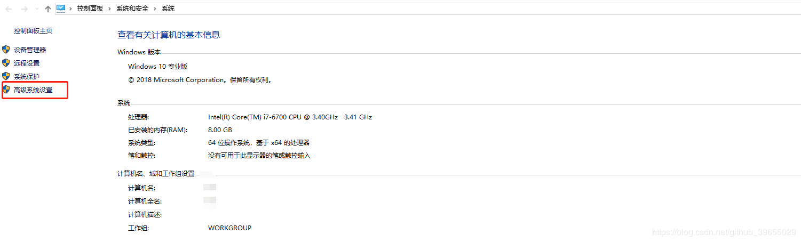
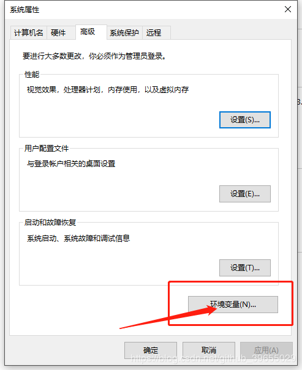
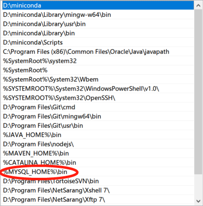
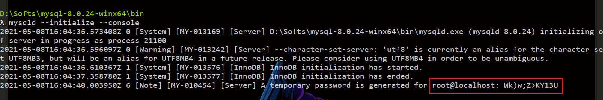
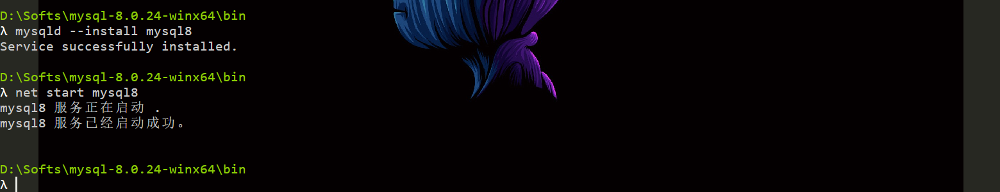
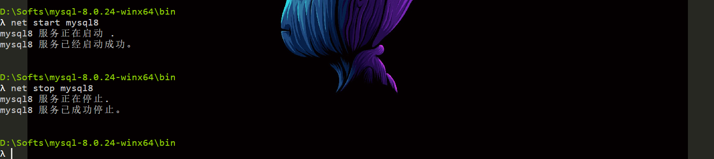
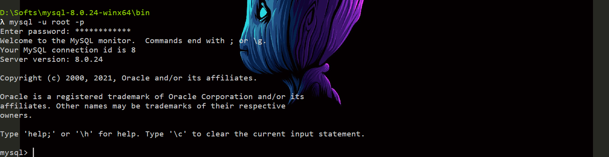
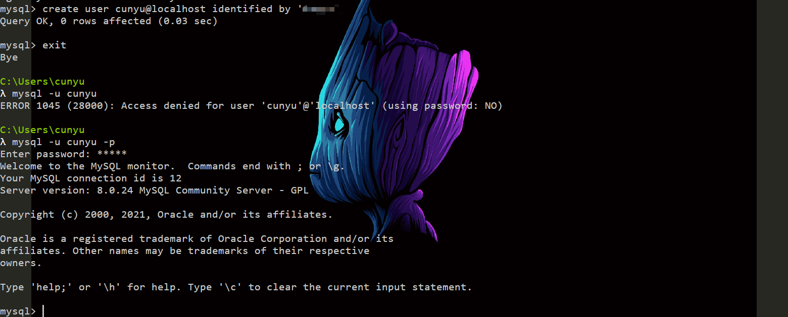

作者：村雨遥

博客：[JavaPark](https://cunyu1943.github.io/JavaPark)

> 吾生也有涯，而知也无涯。

了解了数据库的相关知识之后，接下来就是搭建 MySQL 的开发环境了。今天就来看看，如何在你的电脑中安装 MySQL。在正式安装过程开始之前，你需要先下载好 MySQL 的安装压缩包，下载地址如下。

> https://dev.mysql.com/downloads/mysql/

## 解压缩

将下载的 MySQL 压缩包解压并移到你所要安装的路径，下面以我的安装路径 `D:\Softs\mysql-8.0.24-winx64` 为例。

## 配置文件

解压完成后，在解压后的目录下新建`my.ini`文件，然后在文件中加入以下配置。

```shell
[mysqld]
# 设置3306端口
port=3306
# 设置mysql的安装目录
basedir=D:\Softs\mysql-8.0.24-winx64
# 设置mysql数据库的数据的存放目录
datadir=D:\Softs\mysql-8.0.24-winx64\data
max_allowed_packet = 20M
# 允许最大连接数
max_connections=200
# 允许连接失败的次数
max_connect_errors=10
# 服务端使用的字符集默认为utf8
character-set-server=utf8

[mysql]
# 设置mysql客户端默认字符集
default-character-set=utf8
[client]
# 设置mysql客户端连接服务端时默认使用的端口
port=3306
# 设置mysql客户端默认字符集
default-character-set=utf8
```

## 配置环境变量

1.  依次打开控制面板->系统与安全->系统，进入高级系统设置，如下图所示。



2.  然后进行环境变量的设置，需要设置两个环境变量：

- `MYSQL_HOME`：也就是我们存放 MySQL 8.0.x 解压缩包的位置；
- `Path`：`%MYSQL_HOMT%\bin`；

具体设置见以下的图：






## 初始化

设置好环境变量之后，从控制台进入 MySQL 解压后的路径，然后以管理员身份执行如下命令。

```shell
mysqld --initialize --console
```

**注意**：执行成功后会打印出初始的 root 用户密码，一定要记住！！！方便后边修改密码；



## 安装数据库服务

接上一步初始化数据库后，继续执行如下命令。

```shell
mysqld --install mysql8
```

表示安装名为 `mysql8` 的服务。



## 启动与关闭 MySQL 数据库服务

```shell
# 开启
net start mysql8
# 关闭
net stop mysql8
```



## 修改初始 root 用户密码

先用刚才记住的初始 `root` 用户密码登陆，然后进行密码更改，命令如下。

```shell
# 登陆
mysql -u root -p
# 然后提示你输入密码，输入上边初始化时默认给的初始化密码，进行登陆
# 密码修改
alter user 'root'@'localhost' identified by '新密码';
# 修改密码
```



## 创建普通用户并设置密码

登入 `root` 用户后，创建新的用户并指定密码如下。

```shell
CREATE USER 'userName'@'localhost' IDENTIFIED BY 'password';
```

接着退出 `root` 用户登陆，尝试用你所创建的新用户进行登陆，登陆成功的提示如下。



## 总结

好了，通过上面的流程，是不是知道了如何在 Windows 系统下安装最新的压缩包版 MySQL-8.0.x 呢，而且文中也对如何修改 `root` 用户的默认密码以及如何创建新用户给出了解决方案，是不是简单，那就亲自动手试试吧。