作者：村雨遥

博客：[JavaPark](https://cunyu1943.github.io/JavaPark)

> 吾生也有涯，而知也无涯。

---

## 前言

大家在使用 JetBrains 开发工具时，往往会受限于社区版某些功能的缺失。为了进行必要的开发工作，不得不使用专业版，这样一来问题就来了。专业版需要授权，但是对于个人用户来说价格还是有点贵的，于是为了寻求免费授权，不得不去网上找各种激活码或者破解教程，然后呢过一段时间可能又失效了，折腾来折腾去就很心累了。为了减少必要的麻烦，所以我们这里教你免费申请 JetBrains 开发工具一年使用权，等到一年过后，再次重新认证下就可以继续使用了，省去了折腾的时间，再也不用担心我们的 JetBrains 开发工具弹出授权失效的弹窗了。

**注意：接下来的内容需要有教育邮箱为前提。**

## 相关介绍及常见问题

对于如何免费申请 JetBrains 开发工具套件，可以先去阅读相关申请条件和申请可能遇到的一些问题，[免费申请详情请点击](https://www.jetbrains.com/zh-cn/community/education/?_ga=2.100493086.1068267370.1584595992-1646227051.1584503956#students)；

## 申请步骤

阅读了免费教育许可证相关信息之后，准备好你的教育邮箱，咱们来正式看看具体的申请过程吧。

1.  进入[申请页](https://www.jetbrains.com/zh-cn/community/education/?_ga=2.100493086.1068267370.1584595992-1646227051.1584503956#students)，然后点击立即申请。

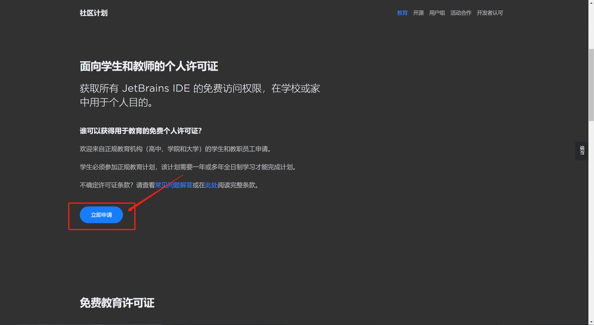

2. 如实填写相关信息。

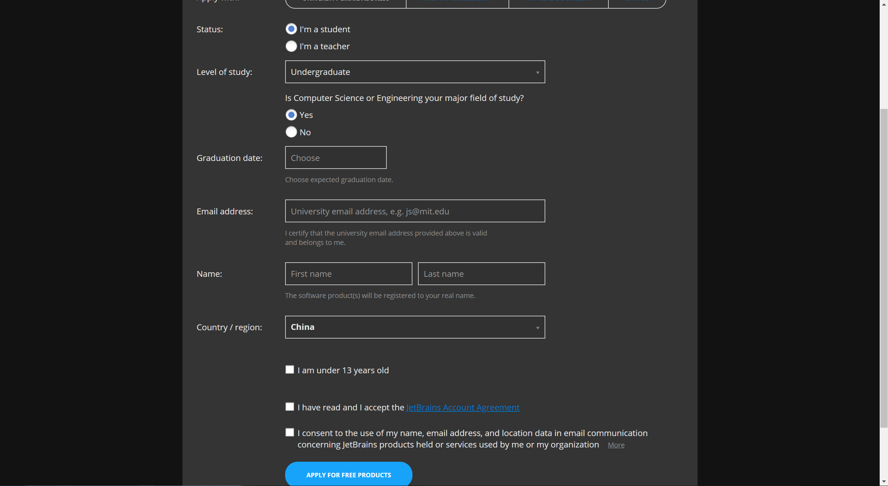

3.  提交信息后，后续步骤会发送到你的教育邮箱，注意进入教育邮箱接收并完成后续步骤。
    

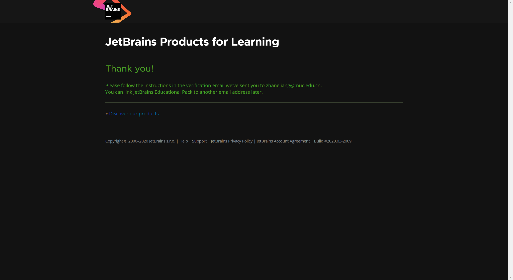

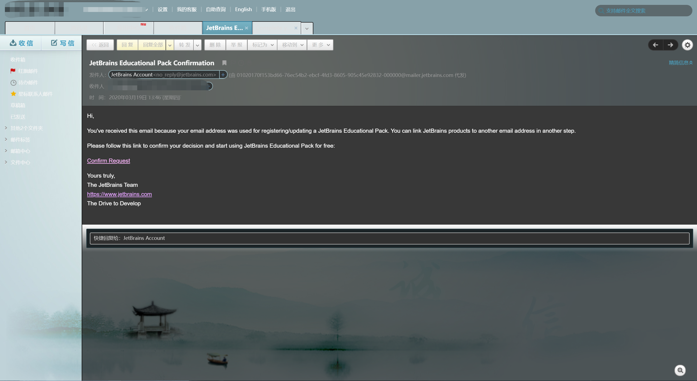

4.  阅读并同意相关条例，然后会发完成注册的邮件到你的教育邮箱，接着去邮箱完成即可。
    

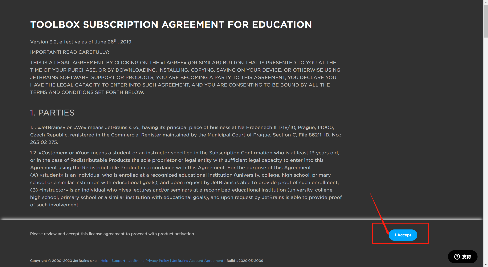

5.  在邮箱中按指示完成注册。

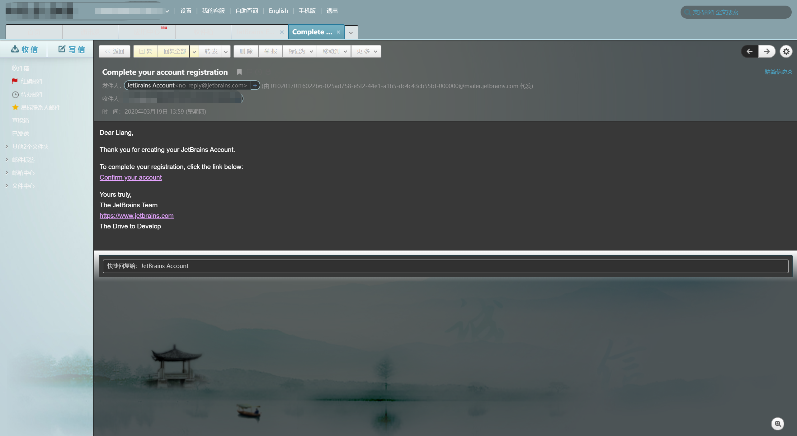

6.  填写注册名以及设置密码后提交。

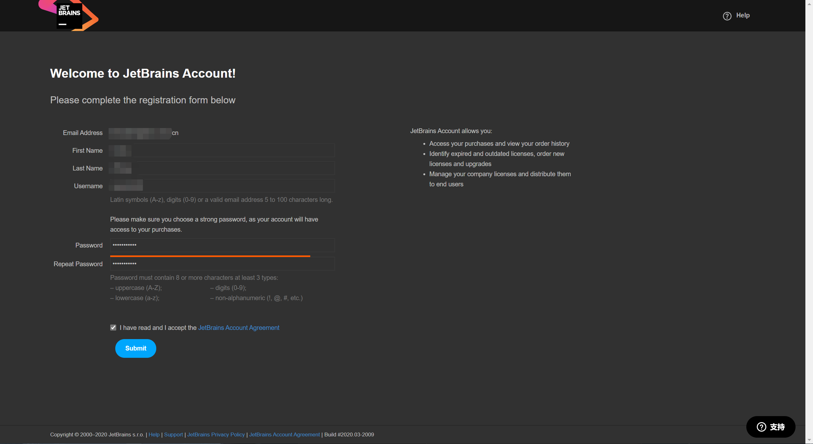

7.  好了，注册完成，下边就可以使用注册好的账号登录使用 JetBrains 开发工具套件了。

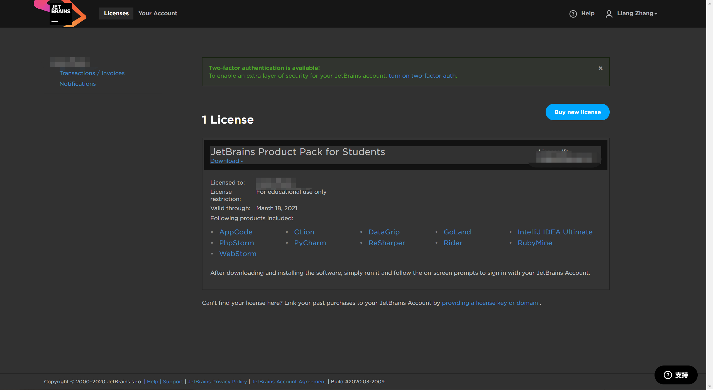

## 如何续期

以上的步骤完成之后，默认往往只有一年的使用时间，到其之后一般就会在开发工具中提醒，如：

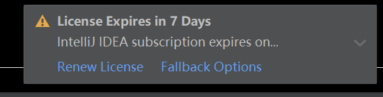

这个时候，我们需要到官网进行续期，登录之后，我们只需要在 License 页面点击 `Renew my Education Pack` ，然后我们确认相关信息之后，它就会发送续期邮件到我们的邮箱。

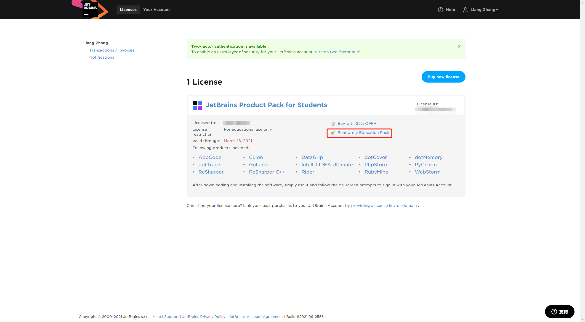

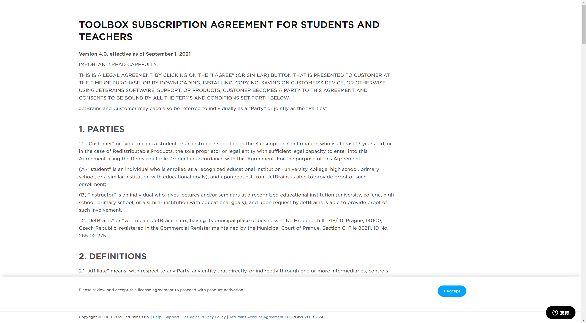

接着我们只需要点击 `Accept` 同意即可。

## 总结

以上就是我们利用教育邮箱来免费申请 JetBrains 家的系列开发工具的免费授权了，而且对我们到期后如何续期也进行了说明，如果你手里也有可用的教育邮箱，那就赶紧去申请吧！再也不用去费力找各种破解版了 ~
