# 一、Java 概述

## 0. 本文预览

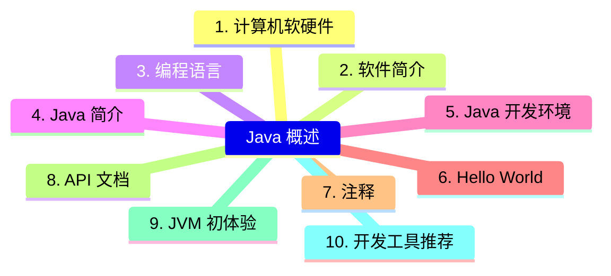

## 1. 计算机软硬件

### 1.1 计算机的组成

计算机的组成只要指的是系统结构的逻辑实现，包括机器内的数据流和控制流的组成以及逻辑设计等。主要分为五个部分，分别是：

-   **控制器**
-   **运算器**
-   **存储器**
-   **输入设备**
-   **输出设备**


### 1.2 CPU、内存、硬盘

1.   **CPU**

`Central Processing Unit`，中文译为中央处理器，是整个计算机中最为核心的部件，计算机就是通过 `CPU` 来进行运算和控制的。如果把计算机比作一个人，那么 `CPU` 就是人的大脑。

2.   **硬盘**

主要用于存储计算机中的数据，是计算机中最主要的存储设备，具有容量大、断电不怕数据丢失的特点。目前，常见的硬盘主要分为：

-   **机械硬盘（HDD）**
-   **固态硬盘（SSD）**
-   **混合硬盘（SSHD）**

固态硬盘无论是在开机速度还是程序运行方面，其加载速度都远超机械硬盘，但有一个缺点就是价格昂贵，因此无法做到全面取代机械硬盘。

3.   **内存**

主要负责计算机中硬盘和 `CPU` 之间的数据交换处理。一般用来保存从硬盘中读取数据，然后提供给 `CPU` 使用。此外，对于 `CPU` 中的一些临时的运算结果，也通常保存在内存中，以便 `CPU` 再次使用或直接保存到硬盘中。不同于硬盘就算断电也不会丢数据的特点，内存一旦断电，那么它所保存的数据就将丢失。


## 2. 软件简介

### 2.1 什么是软件

>   软件 = 数据结构 + 算法

所谓软件，就是一系列按照特顺序组织的数据和指令的合集，如果说硬件是计算机中的有形部分，那么软件则是计算机中的无形部分。一般来说，计算机软件可以分为系统软件、应用软件，以及介于这两种之间的中间件。

1.   **系统软件**

系统软件指的是控制和协调计算机以及外设，支持应用软件开发和运行的系统，无序用户干预的各种程序的合集。最主要的功能是调度、监控和维护计算机系统，负责计算机中相互独立的硬件，让它们能够协调工作。最常见的系统软件有 `macOS`、`Windows 11`、`Linux`、`Android`、`iOS` 等。

2.   **应用软件**

应用软件是软件的主要分类，指针对用户的某种特殊应用目的所编写的程序，如文本处理、浏览器、沟通交流等。最常见的应用软件有微信、`QQ`、钉钉、网易云音乐、`Chrome` 等。

### 2.2 人机交互方式

人机交互方式是指通过计算机输入、输出设备，以有效的方式从而实现人与计算机对话。比如计算机通过输出设备如显示器给人提供大量相关信息，而人通过输入设备如键盘给计算机输入相关指令，让计算机完成对应工作等。

1.   **命令行方式**

需要在控制台中输入特定的指令，然后计算机才能去完成对应的操作。此时就需要使用者对指令十分熟悉，否则将无法使用计算机。


2.   **图形化界面**

简单直观，使用者能够十分容易就上手，只需要点点鼠标、输入文字等就能完成对应的操作。


### 2.3 常用 Dos 命令

`Dos（Disk Operating System）`，中文译为磁盘操作系统。它是微软早期在推出 `Windows` 之前的一个操作系统，是一个单用户、单任务的操作系统，能够直接操纵管理硬盘中的文件。

#### 2.3.1 如何打开 Dos 窗口

打开的方式很多，这里例举常用的 `5` 种。

1.  **方法 1**

`Win + R` 快捷键打开运行，输入 `cmd` 后回车。

2.  **方法 2**

依次打开开始菜单 -> `Windows` 系统（`Windows` 工具） -> 命令提示符。

3.  **方法 3**

打开资源管理器，然后在地址栏输入 `cmd` 后回车。

4.  **方法 4**

鼠标右键点击开始菜单的 `Win` 图标，找到命令提示符（终端）并进入。

5.  **方法 5**

在任务栏中的搜索栏中搜索 `cmd` 并打开。


#### 2.3.2 目录操作

1.  **磁盘切换**

```shell
盘符 + 冒号
```

如 `D:` 就代码进入 `D` 盘。


2.  **进入指定目录**

```shell
cd 目录
```


3.  **返回磁盘根目录**

```shell
cd \
```


4.  **返回上级目录**

```shell
cd ..
```


5.  **新建目录**

```shell
md 目录名
```


6.  **查看当前目录中内容**

```shell
dir
```


7.  **查看指定目录结构**

```shell
tree 目录
```


8.  **删除目录**

```shell
rd 目录名
```


9.  **复制文件**

```shell
copy 源文件 目标文件
```


10. **删除文件**

```shell
del 文件名
```


#### 2.3.3 开关机操作

1.  **关机**

```shell
shutdown /s
```

2.  **重启**

```shell
shutdown /r
```

3.  **注销**

```shell
shutdown /l
```

4.  **休眠**

```shell
shutdown /h /f
```

5.  **定时关机**

```shell
shutdown /s /t 时间（秒）
```


6.  **取消关机**

```shell
shutdown /a
```


#### 2.3.4 网络操作

1.  **测试网络延迟和丢包率**

```shell
ping ip/域名
```


2.  **查看本机 ip 地址**

```shell
ipconfig
```


3.  **清除本地 DNS 缓存**

```shell
ipconfig /flushdns
```


4.  **路由追踪**

```shell
tracert ip/域名
```


#### 2.3.5 进程/服务操作

1.  **查看当前运行的进程**

```shell
tasklist
```


2.  **运行指定程序或命令**

```shell
start 程序名
```

3.  **按名称结束进程**

```shell
taskkill /im 进程名
```


4.  **按 PID 结束进程**

```shell
taskkill /pid PID
```


5.  **查看当前运行的服务**

```shell
net start
```


6.  **启动指定服务**

```shell
net start 服务名
```


7.  **停止指定服务**

```shell
net stop 服务名
```


#### 2.3.6 其他操作

1.  **清除屏幕**

```shell
cls
```


2.  **退出**

```shell
exit
```

## 3. 编程语言

### 3.1 什么是计算机语言

在聊计算机语言之前，我们先来看看什么叫做语言。所谓语言，就是人与人之间沟通的一种方式。比如我们日常生活中用普通话沟通，而和外国人则是用英语沟通。

而计算机语言指用于人和计算机之间相互沟通的语言，我们通过编程语言编程后对计算机下达指令，然后让计算机去完成我们所需的功能。计算机是人和计算机之间信息传递的媒介，它和人类语言一样，也有很多种，比如 `C`、`C++`、`Java`、`Python`、`Go` 等。

### 3.2 计算机语言分类

计算机语言的种类非常多，但总体上可分为以下三大类：

-   **机器语言**
-   **汇编语言**
-   **高级语言**

1.   **机器语言**

机器语言指的是一台计算机全部的指令集合。最开始，计算机中的指令和数据都是由 `0` 和 `1` 组成的二进制数。

2.   **汇编语言**


3.   **高级语言**

### 3.3 计算机语言排行榜


## 4. Java 简介

## 5. Java 开发环境

## 6. Hello World

## 7. 注释

## 8. API 文档

## 9. JVM 初体验

## 10. 开发工具推荐

### 10.1 文本开发工具

也就是常说的文本编辑器，是用来编写普通文字的应用软件，而程序开发者则一般用来编写程序的源代码。目前常用的几款文本编辑器主要有：

1.   **Visual Studio Code**

-   下载地址：https://code.visualstudio.com/


一个完全免费的跨平台文本编辑器，支持 ``Windows`、`macOS`、`Linux`，具有开源访问权限和大量扩展集，内置 `Git` 命令。而且社区活跃，包含大量使用文档、常见问题等内容。


2.   **Sublime Text**

-   下载地址：https://www.sublimetext.com/download


`Sublime Text` 是一个轻量、简洁、高效、跨平台的编辑器。支持安装扩展、即时文件切换、`Vim` 模式、宏定义等，简约而不失强大。

3.   **HBuilder X**

- 下载地址：https://www.dcloud.io/hbuilderx.html


>   `HBuilderX`，`H` 是 `HTML` 的首字母，`Builder` 是构造者，`X` 是 `HBuilder` 的下一代版本。我们也简称 `HX`。 `HX` 是轻如编辑器、强如 `IDE` 的合体版本。

一款轻巧、急速的堪比 `IDE` 的强大编辑器，支持小程序、`Vue` 开发、语法提示功能强大、`json` 支持更强，此外还支持安装各种丰富的插件，进一步提高工作效率。

4.   **UltraEdit**

-   下载地址：https://www.ultraedit.com/


一个支持多平台的文本编辑器，可以支持基本语法和二十多种语言。它使用方便，可以用颜色标注重点部分，支持进行内嵌式编辑，也可以进行代码编辑。

5.   **Notepad3**

-   下载地址：https://www.rizonesoft.com/downloads/notepad3/


`Notepad3` 是一个快速且轻量级的基于 `Scintilla` 的文本编辑器，具有语法突出显示功能。它的内存占用量很小，但功能强大，足以处理大多数编程作业。

6.   **Vim**

-   下载地址：https://www.vim.org/download.php


`Vim` 是从 `vi` 发展出来的一个文本编辑器。代码补全、编译及错误跳转等方便编程的功能特别丰富，在程序员中被广泛使用，是类 `Unix` 系统用户最喜欢的文本编辑器之一。当然，在 `Windowns` 中也能通过安装从而使用上这个编辑器。

### 10.2 集成开发工具

也就是常说的 `IDE(Integrated Development Environment)`，是将代码编写、编译、执行、调试等多项功能综合到一起的开发工具。

1.   **IntelliJ IDEA**

-   下载地址：https://www.jetbrains.com/zh-cn/idea/


业界公认为最好的 `Java` 开发工具，尤其在智能代码助手、代码自动提示、重构、`JavaEE` 支持、各类版本工具(`git`、`svn` 等)、`JUnit`、`CVS` 整合、代码分析、 创新的 `GUI` 设计等方面的功能可以说是超常的。`IDEA` 是 `JetBrains` 公司的产品，总部位于捷克共和国的首都布拉格，开发人员以严谨著称的东欧程序员为主。分为旗舰版和社区版，旗舰版支持 `HTML`，`CSS`，`PHP`，`MySQL`，`Python` 等，而社区版只支持 `Java`,`Kotlin` 等少数语言。

2.   **Eclipse**

-   下载地址：https://www.eclipse.org/downloads/packages/


`Eclipse` 是一个开放源代码的、基于 `Java` 的可扩展开发跨平台的自由集成开发环境。就其本身而言，它只是一个框架和一组服务，用于通过插件组件构建开发环境。同时，`Eclipse` 附带了一个标准的插件集，包括Java开发工具（`Java Development Kit`，`JDK`）。通过安装各种插件，从而达到支持不同的计算机语言，如 `C++`、`Python` 等。

3.   **Apache NetBeans**

-   下载地址：https://netbeans.apache.org/download/index.html


`NetBeans` 是开源软件开发集成环境，是一个开放框架，可扩展的开发平台，可以用于 `Java`、`C/C++`，`PHP` 等语言的开发。

4.   **MyEclipse**

-   下载地址：https://www.genuitec.com/products/myeclipse/download/


这是基于 `Eclipse` 加上自己的插件开发而成的功能强大的企业级集成开发环境，主要用于 `Java`、`Java EE` 以及移动应用的开发。在最新版的 `MyEclipse` 中，对各种开源产品和主流开发框架的支持相当不错。已支持 `PHP`、`Python`、`Vue`、`Angular`、`React`、`Java`、`Java EE` 等语言和框架开发。

# 二、变量与运算符

## 0. 本文预览

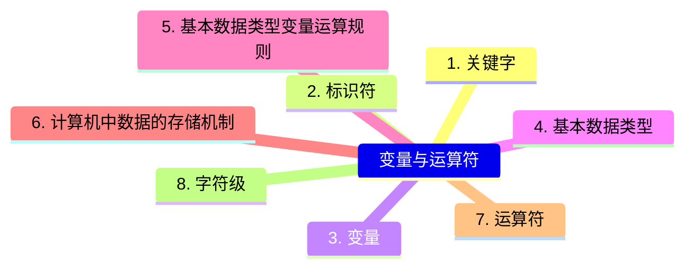


## 1. 关键字

## 2. 标识符

## 3. 变量

## 4. 基本数据类型

## 5. 基本数据类型变量运算规则

## 6. 计算机中数据的存储机制

## 7. 运算符

## 8. 字符集

# 三、流程控制

## 0. 本文预览

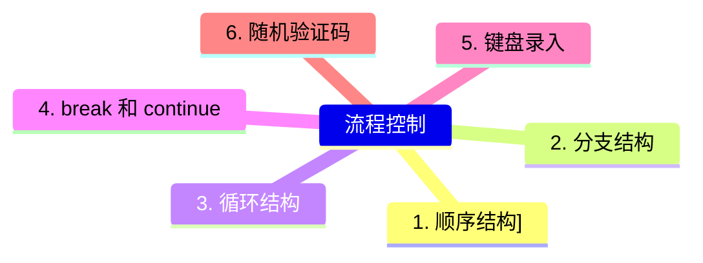


## 1. 顺序结构

## 2. 分支结构

## 3. 循环结构

## 4. break 和 continue

## 5. 键盘录入

## 6. 随机验证码

# 四、数组

## 0. 本文概览

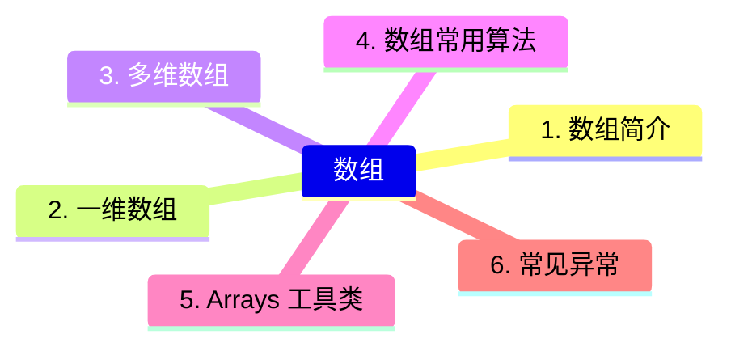

## 1. 数组简介

## 2. 一维数组

## 3. 多维数组

## 4. 数组常用算法

## 5. Arrays 工具类

## 6. 常见异常

# 五、 面向对象（上）

## 0. 本文预览

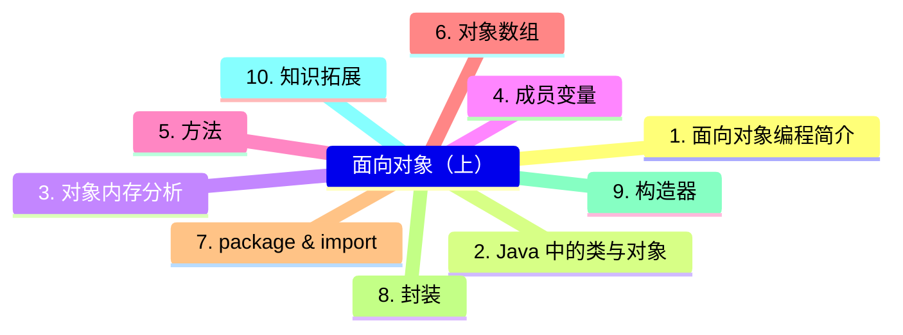


## 1. 面向对象编程简介

## 2. Java 中的类与对象

## 3. 对象内存分析

## 4. 成员变量

## 5. 方法

## 6. 对象数组

## 7. package & import

## 8. 封装

## 9. 构造器

## 10. 知识拓展

# 六、 面向对象（中）

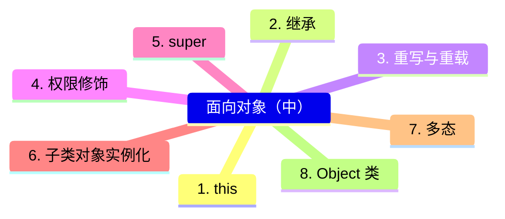


## 1. this

## 2. 继承

## 3. 重写与重载

## 4. 权限修饰

## 5. super

## 6. 子类对象实例化

## 7. 多态

## 8. Object 类

# 七、 面向对象（下）

## 0. 本文预览

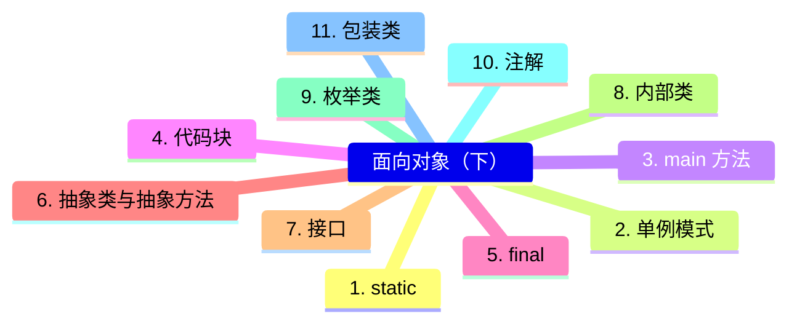
## 1. static

## 2. 单例模式
## 3. main 方法
## 4. 代码块
## 5. final
## 6. 抽象类与抽象方法
## 7. 接口
## 8. 内部类
## 9. 枚举类
## 10. 注解
## 11. 包装类
# 八、 异常处理

## 0. 本文预览

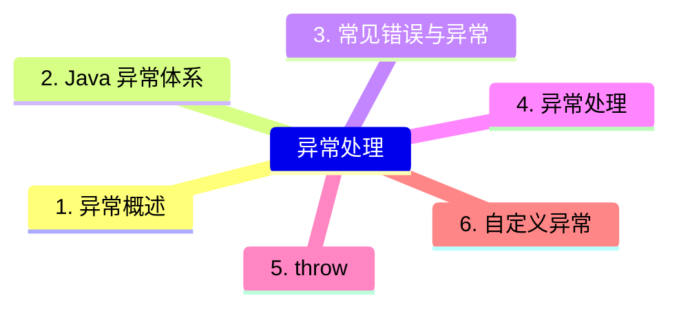


## 1. 异常概述

## 2. Java 异常体系

## 3. 常见错误与异常

## 4. 异常处理

## 5. throw

## 6. 自定义异常

# 九、 多线程

## 0. 本文预览

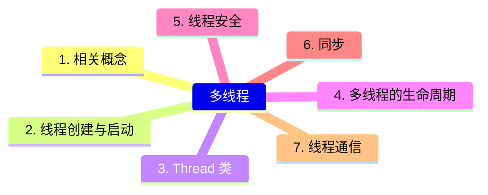


## 1. 相关概念

## 2. 线程创建与启动

## 3. Thread 类

## 4. 多线程的生命周期

## 5. 线程安全

## 6. 同步

## 7. 线程通信

# 十、 常用类和基础 API

## 0. 本文预览

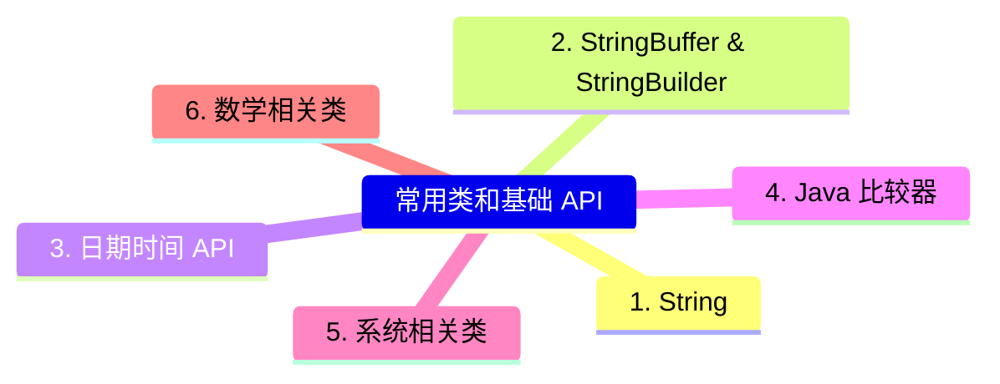


## 1. String

## 2. StringBuffer & StringBuilder

## 3. 日期时间 API

## 4. Java 比较器

## 5. 系统相关类

## 6. 数学相关类

# 十一、 集合

## 0. 本文预览

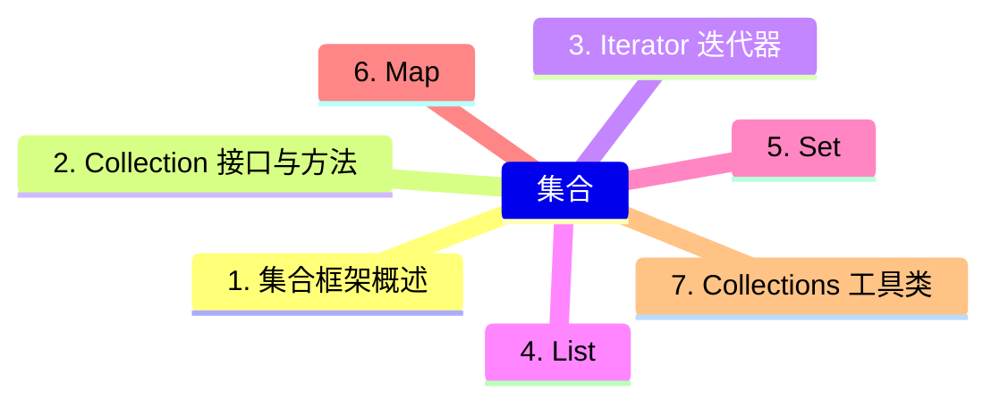


## 1. 集合框架概述

## 2. Collection 接口与方法

## 3. Iterator 迭代器

## 4. List

## 5. Set

## 6. Map

## 7. Collections 工具类

# 十二、 泛型

## 0. 本文预览

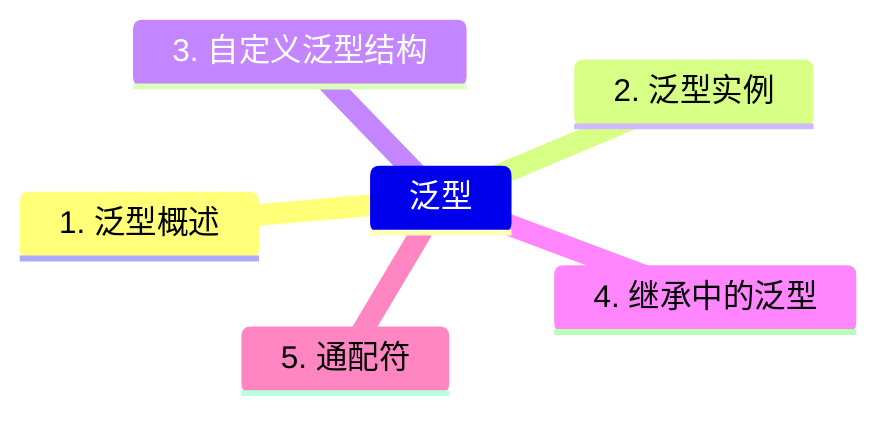


## 1. 泛型概述

## 2. 泛型实例

## 3. 自定义泛型结构

## 4. 继承中的泛型

## 5. 通配符

# 十三、 File 类与 IO 流

## 0. 本文预览

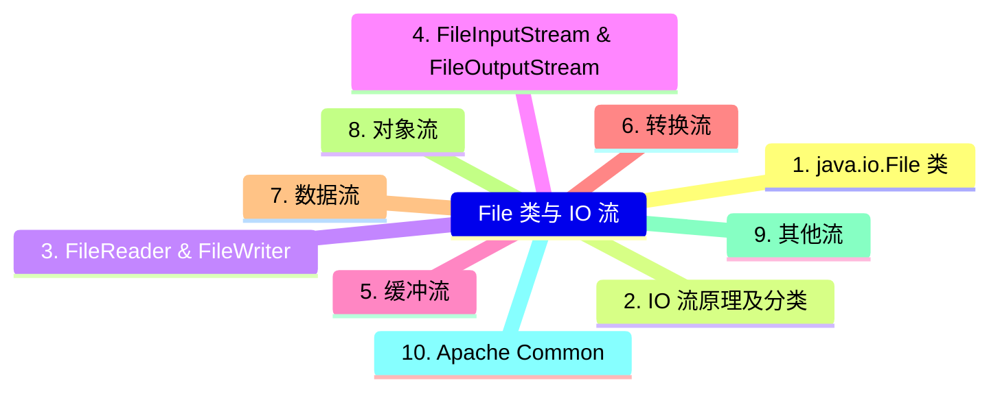


## 1. java.io.File 类

## 2. IO 流原理及分类

## 3. FileReader & FileWriter

## 4. FileInputStream & FileOutputStream

## 5. 缓冲流

## 6. 转换流

## 7. 数据流

## 8. 对象流

## 9. 其他流

## 10. Apache Common


# 十四、 网络编程

## 0. 本文预览

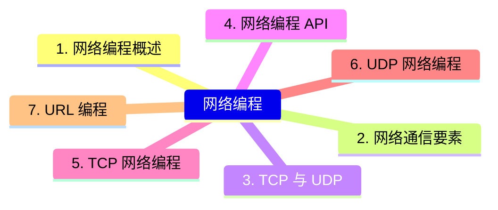

## 1. 网络编程概述

## 2. 网络通信要素

## 3. TCP 与 UDP

## 4. 网络编程 API

## 5. TCP 网络编程

## 6. UDP 网络编程

## 7. URL 编程


# 十五、 反射机制

## 0. 本文预览

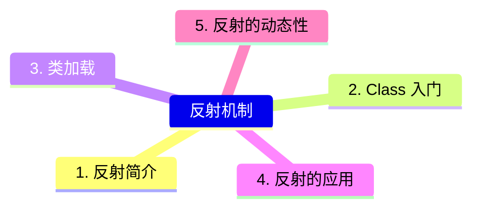

## 1. 反射简介

## 2. Class 入门

## 3. 类加载

## 4. 反射的应用

## 5. 反射的动态性

# 十六、 常用数据结构

## 0. 本文预览

```mermaid
mindmap

常用数据结构
	1. 数据结构简介
	2. 数组
	3. 链表
	4. 栈
	5. 队列
	6. 树与二叉树
	7. List
	8. Map
	9. Set
```

## 1. 数据结构简介

## 2. 数组

## 3. 链表

## 4. 栈

## 5. 队列

## 6. 树与二叉树

## 7. List

## 8. Map

## 9. Set

