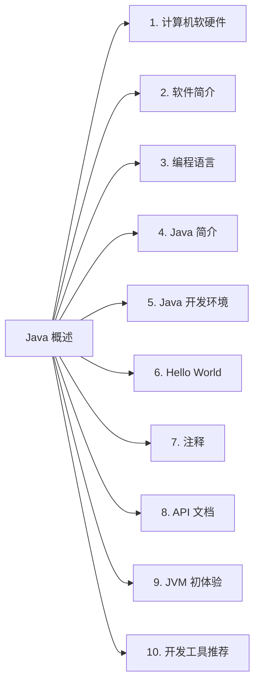
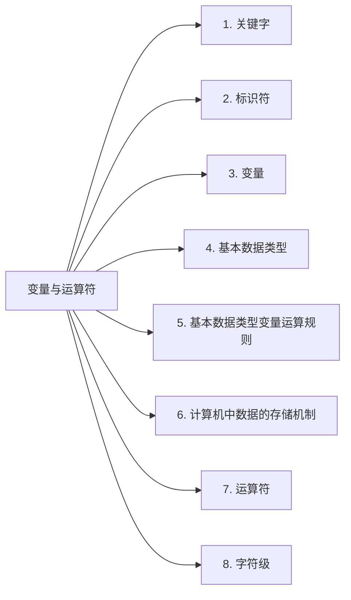
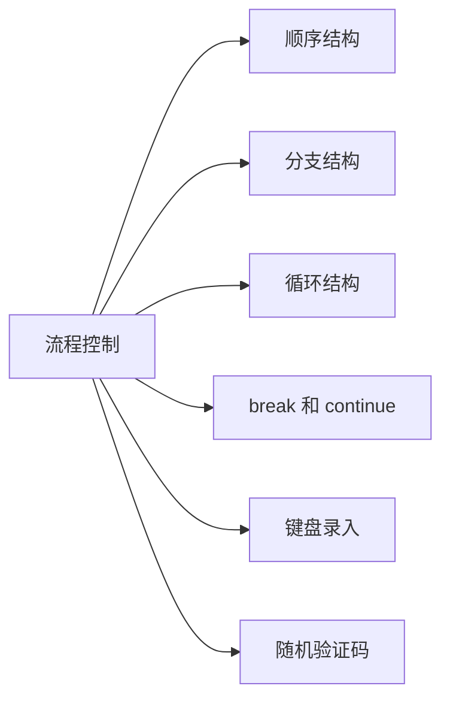
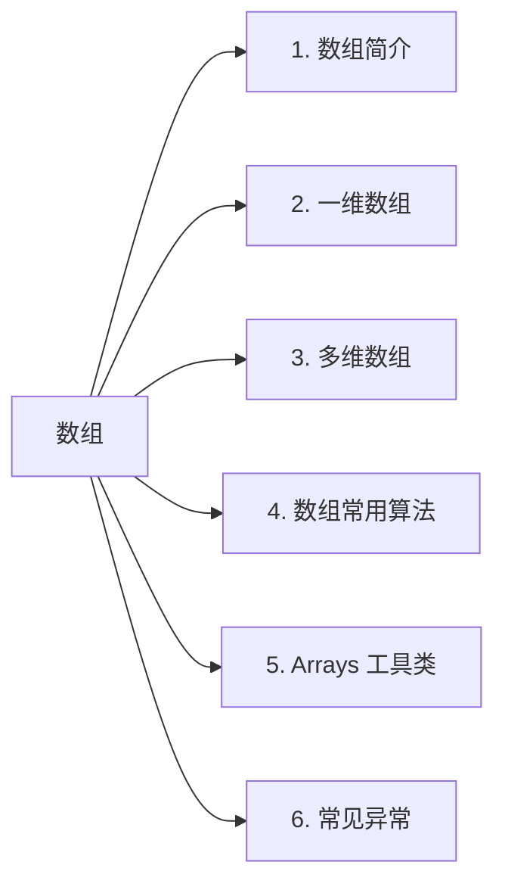

# 一、Java 概述

## 0. 本文导航

## 1. 计算机软硬件

## 2. 软件简介

## 3. 编程语言

## 4. Java 简介

## 5. Java 开发环境

## 6. Hello World

## 7. 注释

## 8. API 文档

## 9. JVM 初体验

## 10. 开发工具推荐

### 10.1 文本开发工具

也就是常说的文本编辑器，是用来编写普通文字的应用软件，而程序开发者则一般用来编写程序的源代码。目前常用的几款文本编辑器主要有：

1.   **Visual Studio Code**

-   下载地址：https://code.visualstudio.com/

一个完全免费的跨平台文本编辑器，支持 ``Windows`、`macOS`、`Linux`，具有开源访问权限和大量扩展集，内置 `Git` 命令。而且社区活跃，包含大量使用文档、常见问题等内容。

2.   **Sublime Text**

-   下载地址：https://www.sublimetext.com/download

`Sublime Text` 是一个轻量、简洁、高效、跨平台的编辑器。支持安装扩展、即时文件切换、`Vim` 模式、宏定义等，简约而不失强大。

3.   **HBuilder X**

- 下载地址：https://www.dcloud.io/hbuilderx.html

>   `HBuilderX`，`H` 是 `HTML` 的首字母，`Builder` 是构造者，`X` 是 `HBuilder` 的下一代版本。我们也简称 `HX`。 `HX` 是轻如编辑器、强如 `IDE` 的合体版本。

一款轻巧、急速的堪比 `IDE` 的强大编辑器，支持小程序、`Vue` 开发、语法提示功能强大、`json` 支持更强，此外还支持安装各种丰富的插件，进一步提高工作效率。

4.   **UltraEdit**

-   下载地址：https://www.ultraedit.com/

一个支持多平台的文本编辑器，可以支持基本语法和二十多种语言。它使用方便，可以用颜色标注重点部分，支持进行内嵌式编辑，也可以进行代码编辑。

5.   **Notepad3**

-   下载地址：https://www.rizonesoft.com/downloads/notepad3/

`Notepad3` 是一个快速且轻量级的基于 `Scintilla` 的文本编辑器，具有语法突出显示功能。它的内存占用量很小，但功能强大，足以处理大多数编程作业。

6.   **Vim**

-   下载地址：https://www.vim.org/download.php

`Vim` 是从 `vi` 发展出来的一个文本编辑器。代码补全、编译及错误跳转等方便编程的功能特别丰富，在程序员中被广泛使用，是类 `Unix` 系统用户最喜欢的文本编辑器之一。当然，在 `Windowns` 中也能通过安装从而使用上这个编辑器。

### 10.2 集成开发工具

也就是常说的 `IDE(Integrated Development Environment)`，是将代码编写、编译、执行、调试等多项功能综合到一起的开发工具。

1.   **IntelliJ IDEA**

-   下载地址：https://www.jetbrains.com/zh-cn/idea/

业界公认为最好的 `Java` 开发工具，尤其在智能代码助手、代码自动提示、重构、`JavaEE` 支持、各类版本工具(`git`、`svn` 等)、`JUnit`、`CVS` 整合、代码分析、 创新的 `GUI` 设计等方面的功能可以说是超常的。`IDEA` 是 `JetBrains` 公司的产品，总部位于捷克共和国的首都布拉格，开发人员以严谨著称的东欧程序员为主。分为旗舰版和社区版，旗舰版支持 `HTML`，`CSS`，`PHP`，`MySQL`，`Python` 等，而社区版只支持 `Java`,`Kotlin` 等少数语言。

2.   **Eclipse**

-   下载地址：https://www.eclipse.org/downloads/packages/

`Eclipse` 是一个开放源代码的、基于 `Java` 的可扩展开发跨平台的自由集成开发环境。就其本身而言，它只是一个框架和一组服务，用于通过插件组件构建开发环境。同时，`Eclipse` 附带了一个标准的插件集，包括Java开发工具（`Java Development Kit`，`JDK`）。通过安装各种插件，从而达到支持不同的计算机语言，如 `C++`、`Python` 等。

3.   **Apache NetBeans**

-   下载地址：https://netbeans.apache.org/download/index.html

`NetBeans` 是开源软件开发集成环境，是一个开放框架，可扩展的开发平台，可以用于 `Java`、`C/C++`，`PHP` 等语言的开发。

4.   **MyEclipse**

-   下载地址：https://www.genuitec.com/products/myeclipse/download/

这是基于 `Eclipse` 加上自己的插件开发而成的功能强大的企业级集成开发环境，主要用于 `Java`、`Java EE` 以及移动应用的开发。在最新版的 `MyEclipse` 中，对各种开源产品和主流开发框架的支持相当不错。已支持 `PHP`、`Python`、`Vue`、`Angular`、`React`、`Java`、`Java EE` 等语言和框架开发。

# 二、变量与运算符

## 0. 本文导航

## 1. 关键字

## 2. 标识符

## 3. 变量

## 4. 基本数据类型

## 5. 基本数据类型变量运算规则

## 6. 计算机中数据的存储机制

## 7. 运算符

## 8. 字符集

# 三、流程控制

## 0. 本文预览

## 1. 顺序结构

## 2. 分支结构

## 3. 循环结构

## 4. break 和 continue

## 5. 键盘录入

## 6. 随机验证码

# 四、数组

## 0. 本文概览

## 1. 数组简介

## 2. 一维数组

## 3. 多维数组

## 4. 数组常用算法

## 5. Arrays 工具类

## 6. 常见异常

# 五. 面向对象（上）

# 六. 面向对象（中）

# 七. 面向对象（下）

# 八. 异常处理

# 九. 多线程

# 十. 常用类和基础 API

# 十一. 集合

# 十二. 范型

# 十三. File 类与 IO 流

# 十四. 网络编程

# 十五. 反射机制

# 十六. 常用数据结构

## 1. 数据结构简介

## 2. 数组

## 3. 链表

## 4. 栈

## 5. 队列

## 6. 树与二叉树

## 7. List

## 8. Map

## 9. Set

