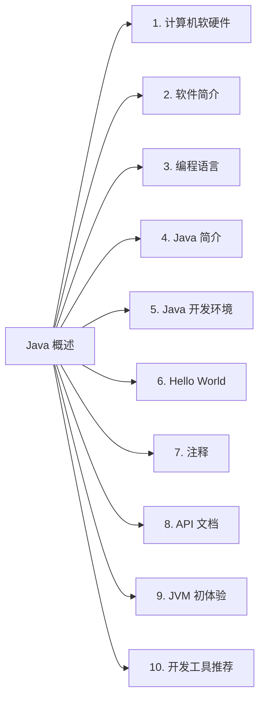

# 一、Java 概述

## 0. 本文导航

## 1. 计算机软硬件

## 2. 软件简介

## 3. 编程语言

## 4. Java 简介

## 5. Java 开发环境

## 6. Hello World

## 7. 注释

## 8. API 文档

## 9. JVM 初体验

## 10. 开发工具推荐

### 10.1 文本开发工具

也就是常说的文本编辑器，是用来编写普通文字的应用软件，而程序开发者则一般用来编写程序的源代码。目前常用的几款文本编辑器主要有：

1.   **Visual Studio Code**

-   下载地址：https://code.visualstudio.com/

一个完全免费的跨平台文本编辑器，支持 ``Windows`、`macOS`、`Linux`，具有开源访问权限和大量扩展集，内置 `Git` 命令。而且社区活跃，包含大量使用文档、常见问题等内容。

2.   **Sublime Text**

-   下载地址：https://www.sublimetext.com/download

`Sublime Text` 是一个轻量、简洁、高效、跨平台的编辑器。支持安装扩展、即时文件切换、`Vim` 模式、宏定义等，简约而不失强大。

3.   **HBuilder X**

- 下载地址：https://www.dcloud.io/hbuilderx.html

>   `HBuilderX`，`H` 是 `HTML` 的首字母，`Builder` 是构造者，`X` 是 `HBuilder` 的下一代版本。我们也简称 `HX`。 `HX` 是轻如编辑器、强如 `IDE` 的合体版本。

一款轻巧、急速的堪比 `IDE` 的强大编辑器，支持小程序、`Vue` 开发、语法提示功能强大、`json` 支持更强，此外还支持安装各种丰富的插件，进一步提高工作效率。

4.   **UltraEdit**

-   下载地址：https://www.ultraedit.com/

一个支持多平台的文本编辑器，可以支持基本语法和二十多种语言。它使用方便，可以用颜色标注重点部分，支持进行内嵌式编辑，也可以进行代码编辑。

5.   **Notepad3**

-   下载地址：https://www.rizonesoft.com/downloads/notepad3/

`Notepad3` 是一个快速且轻量级的基于 `Scintilla` 的文本编辑器，具有语法突出显示功能。它的内存占用量很小，但功能强大，足以处理大多数编程作业。

6.   **Vim**

-   下载地址：https://www.vim.org/download.php

`Vim` 是从 `vi` 发展出来的一个文本编辑器。代码补全、编译及错误跳转等方便编程的功能特别丰富，在程序员中被广泛使用，是类 `Unix` 系统用户最喜欢的文本编辑器之一。当然，在 `Windowns` 中也能通过安装从而使用上这个编辑器。

### 10.2 集成开发工具

1.   **IntelliJ IDEA**

-   下载地址：https://www.jetbrains.com/zh-cn/idea/

### 10.3 如何选择