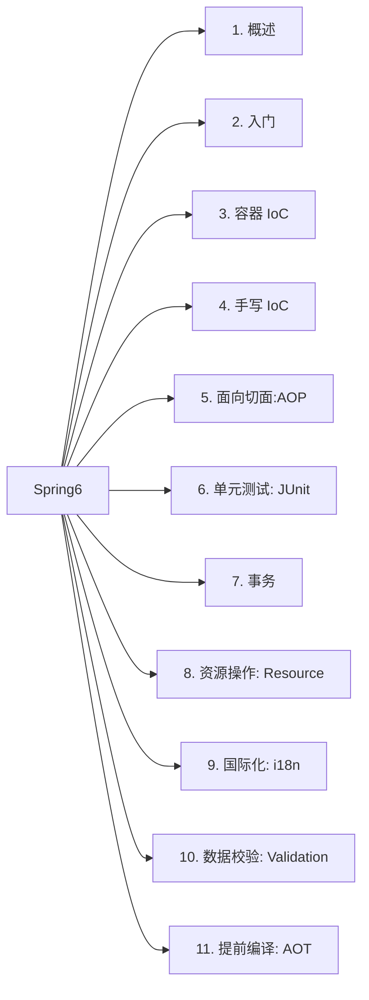
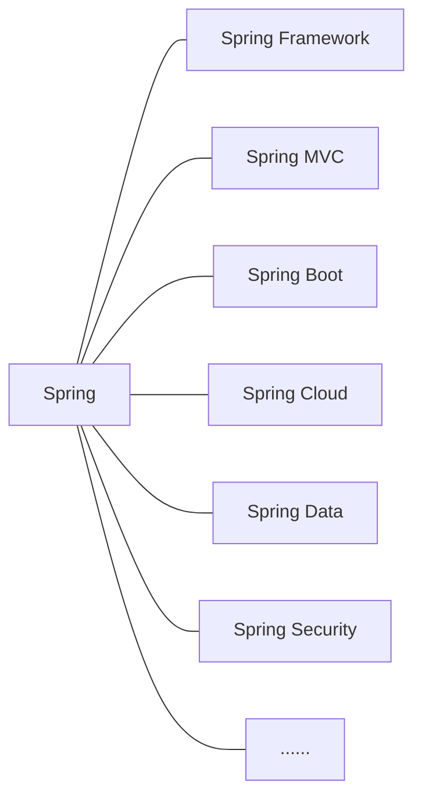

# 大纲

# 一、概述

## 定义

`Spring` 是当前主流的一款 `Java EE` 轻量级开源框架，由“`Spring` 之父” `Rod Johnson` 提出并创立。其目的就是为了简化 `Java` 企业级应用，降低开发难度和缩短开发周期，从而实现快速交付。

`Spring` 应用十分广泛，不仅限于服务器端的开发。从软件设计的简单性、可测试性以及松耦合等多个角度来说，任何 `Java` 应用都能够从 `Spring` 中受益。而 `Spring` 除了提供它自身的功能之外，还提供了整合其他技术和框架的能力，使得 `Spring` 更为强大。

`Spring` 自 `2004` 年 `4` 月正式发布 `1.0` 版本以来，就受到了广大开发者的青睐，将其作为 `Java` 企业级开发的首选。至本文写作的时间（`2023` 年 `1` 月），`Spring` 已经经历了 `6` 个大版本的迭代，其中还穿插着多个小版本的升级。也就是说，目前 `Spring` 已经来到了 `Spring 6`，比起最初的 `1.0` 版本，已经强大了太多。

## 广义和狭义的理解

从不同的角度来理解，`Spring` 所代表的含义是有所不同的。以下就分别从“广义”和“狭义”两个角度，来介绍下 `Spring`.

### 广义

从“广义”的角度而言，`Spring` 泛指以 `Spring Framework` 为核心的 `Spring` 技术栈。经过长时间的发展，`Spring` 从一个单纯的应用框架，衍生为一个由多个不同子模块所组成的成熟技术，主要包括了 `Spring Framework`、`Spring MVC`、`Spring Boot`、`Spring Cloud`、`Spring Data`、`Spring Security`……，而其中 `Spring Framework` 则是其他子模块的基石。

### 狭义

从“狭义”的角度来讲，`Spring` 只指 `Spring Framework`，也就是我们常说的 `Spring` 框架。

`Spring` 框架是一个分层的、面向切面的 `Java` 应用程序的一站式轻量级解决方案，是所有 `Spring` 技术栈的核心和基础，主要是为了降低企业级开发的复杂性，提高开发效率。

`Spring` 中，两个最核心的模块是 `IoC` 和 `AOP`。

其中，`IoC(Inverse of Control)` 中文译为“控制反转”，指的是将创建对象的过程交由 `Spring` 框架来进行自动管理，而不用开发者再去手动操作。

`AOP(Aspect Oriented Programming)`中文译为“面向切面编程”。通过将多个类中与业务无关，但却被业务模块所共同调用的逻辑抽取出来，然后用 `AOP` 对这些公共行为进行封装，从而减少系统中的重复代码，降低各个模块间的耦合度。除此之外，我们还可以用 `AOP` 来解决一些系统层面上的问题，如日志、事务、权限控制等。

## Spring Framework 特点

1.   **非侵入式**

利用 `Spring Framework` 进行应用开发时，`Spring` 对应用本身的结构影响较小。一方面，`Spring` 对领域模型能够做到零污染；另一方面，`Spring` 对功能性组件也只需要使用几个简单的注解进行标记即可，不会对原有结构造成破坏，反而会将组件结构进行进一步简化。

也正是因为如此，基于 `Spring Framework` 开发的应用往往都具有结构清晰、简洁优雅的特点。

2.   **控制反转**

3.   **面向切面编程**

4.   **容器**

5.   **组件化**

6.   **一站式**

## 组成结构

# 二、入门

# 三、容器：IoC

# 四、原理：手动实现 IoC

# 五、面向切面：AOP

# 六、单元测试：JUnit

# 七、事务

# 八、资源操作：Resource

# 九、国际化：i18n

# 十、数据校验：Validation

# 十一、提前编译：AOT