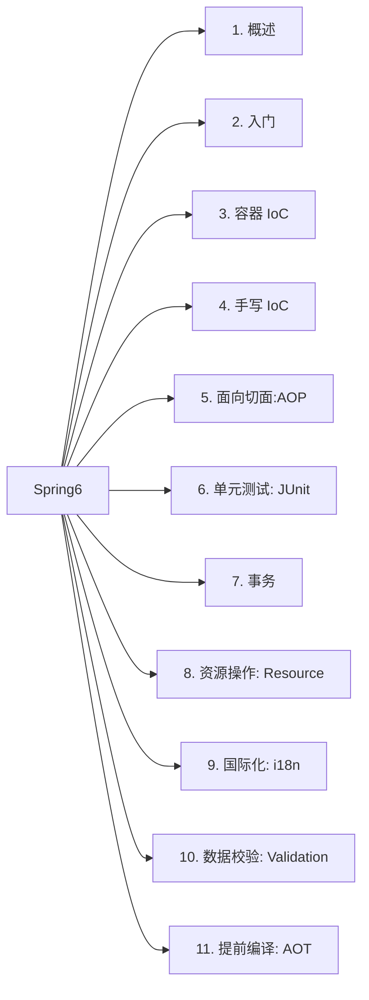
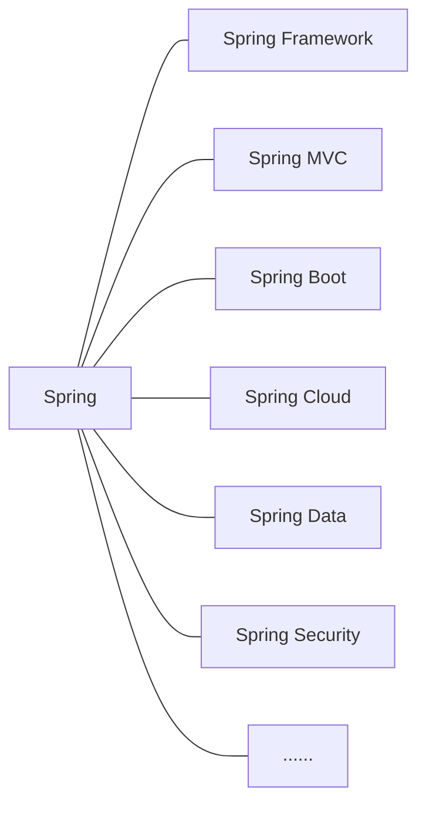
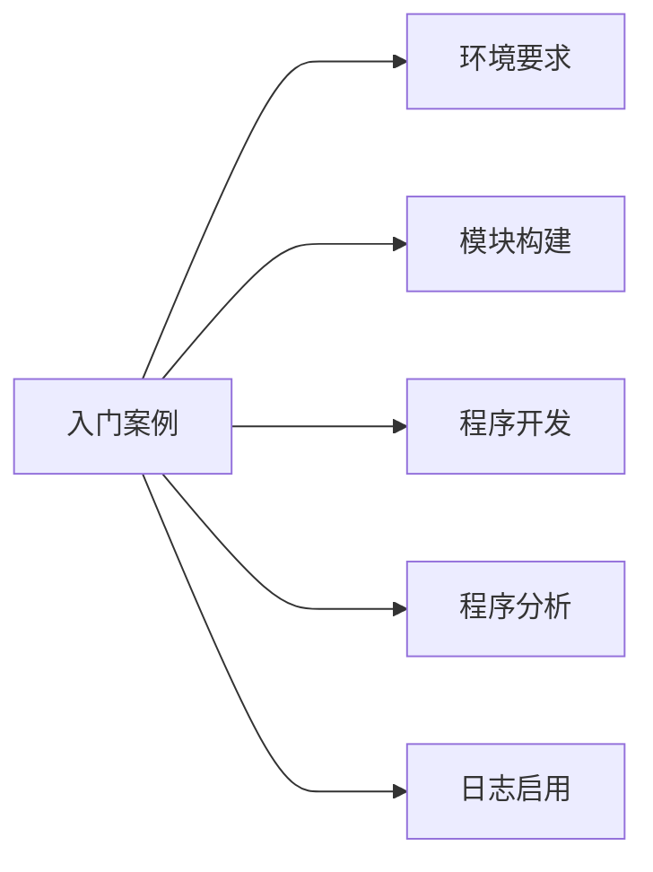
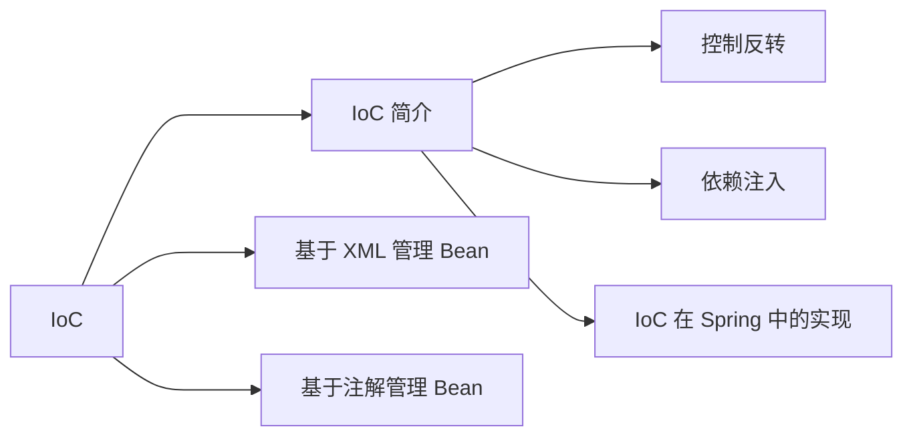

# 大纲




# 一、概述

## 定义

`Spring` 是当前主流的一款 `Java EE` 轻量级开源框架，由“`Spring` 之父” `Rod Johnson` 提出并创立。其目的就是为了简化 `Java` 企业级应用，降低开发难度和缩短开发周期，从而实现快速交付。

`Spring` 应用十分广泛，不仅限于服务器端的开发。从软件设计的简单性、可测试性以及松耦合等多个角度来说，任何 `Java` 应用都能够从 `Spring` 中受益。而 `Spring` 除了提供它自身的功能之外，还提供了整合其他技术和框架的能力，使得 `Spring` 更为强大。

`Spring` 自 `2004` 年 `4` 月正式发布 `1.0` 版本以来，就受到了广大开发者的青睐，将其作为 `Java` 企业级开发的首选。至本文写作的时间（`2023` 年 `1` 月），`Spring` 已经经历了 `6` 个大版本的迭代，其中还穿插着多个小版本的升级。也就是说，目前 `Spring` 已经来到了 `Spring 6`，比起最初的 `1.0` 版本，已经强大了太多。

## 广义和狭义的理解

从不同的角度来理解，`Spring` 所代表的含义是有所不同的。以下就分别从“广义”和“狭义”两个角度，来介绍下 `Spring`.

### 广义

从“广义”的角度而言，`Spring` 泛指以 `Spring Framework` 为核心的 `Spring` 技术栈。经过长时间的发展，`Spring` 从一个单纯的应用框架，衍生为一个由多个不同子模块所组成的成熟技术，主要包括了 `Spring Framework`、`Spring MVC`、`Spring Boot`、`Spring Cloud`、`Spring Data`、`Spring Security`……，而其中 `Spring Framework` 则是其他子模块的基石。




### 狭义

从“狭义”的角度来讲，`Spring` 只指 `Spring Framework`，也就是我们常说的 `Spring` 框架。

`Spring` 框架是一个分层的、面向切面的 `Java` 应用程序的一站式轻量级解决方案，是所有 `Spring` 技术栈的核心和基础，主要是为了降低企业级开发的复杂性，提高开发效率。

`Spring` 中，两个最核心的模块是 `IoC` 和 `AOP`。

其中，`IoC(Inverse of Control)` 中文译为“控制反转”，指的是将创建对象的过程交由 `Spring` 框架来进行自动管理，而不用开发者再去手动操作。

`AOP(Aspect Oriented Programming)`中文译为“面向切面编程”。通过将多个类中与业务无关，但却被业务模块所共同调用的逻辑抽取出来，然后用 `AOP` 对这些公共行为进行封装，从而减少系统中的重复代码，降低各个模块间的耦合度。除此之外，我们还可以用 `AOP` 来解决一些系统层面上的问题，如日志、事务、权限控制等。

## Spring Framework 特点

1.   **非侵入式**

利用 `Spring Framework` 进行应用开发时，`Spring` 对应用本身的结构影响较小。一方面，`Spring` 对领域模型能够做到零污染；另一方面，`Spring` 对功能性组件也只需要使用几个简单的注解进行标记即可，不会对原有结构造成破坏，反而会将组件结构进行进一步简化。

也正是因为如此，基于 `Spring Framework` 开发的应用往往都具有结构清晰、简洁优雅的特点。

2.   **控制反转**

也就是说上边说的 `Spring Framework` 的两大核心之一 `IoC`，这种方式反转了资源获取的方向。从原来需要开发者自己创建资源，然后向环境获取资源变成了现在的环境准备好资源，然后开发者只需要准备好接收环境注入的资源即可。

3.   **面向切面编程**

`Spring Framework` 的另外一个核心 `AOP`，通过这种方式，使得开发者能够在不修改源代码的前提下就实现对代码功能的增强。

4.   **容器**

`Spring IoC` 类似于一个容器，包含了多个组件，同时 `IoC` 还管理着各个组件对象的生命周期。组件经过容器化的管理，为开发者屏蔽了组件创建过程中的大量细节。从而降低了使用门槛，大幅提高开发效率。

5.   **组件化**

`Spring` 将多个简单的组件配置组合为一个复杂的应用，通过使用 `XML` 和 `Java` 注解讲这些对象进行组合。这样开发者就能十分方便地用这些一个个功能明确、边界清晰的组件搭建成一个复杂应用系统。

6.   **一站式**

在 `IoC` 和 `AOP` 两驾马车的驱动下，`Spring` 还可以整合各种企业应用的开源框架和优秀的第三方类库。通过这样的组合，许多方面的功能性需求就能在 `Spring Framework` 的基础上利用 `Spring` 一站式实现。

## 组成结构


### Spring Core（核心容器）

`Spring Core` 提供了 `IoC`、`DI`、`Bean` 配置装载创建的核心实现。

-   `Spring Core`：`IoC` 以及 `DI` 的基本实现。
-   `Spring Beans`：`BeanFactory` 和 `Bean` 的装配管理（`BeanFactory`）。
-   `Spring Context`：`Spring Context` 上下文，即 `IoC` 容器（`ApplcationContext`）。
-   `Spring Expression`：`Spring` 表达式语言。

### Spring AOP

-   `Spring AOP`：面向切面编程的应用实践，整合了 `ASM`、`CGLib`、`JDK Proxy`.
-   `Spring Aspects`：集成 `AspectJ`、`AOP` 应用框架。
-   `Spring Instrument`：动态 `Class Loading` 模块。

### Spring Data Access

-   `Spring Jdbc`：`Spring` 对 `JDBC` 的封装，用于简化 `JDBC` 操作。
-   `Spring ORM`：`Java` 对象与数据库数据的映射框架。
-   `Spring OXM`：对象与 `XML` 文件的映射框架。
-   `Spring JMS`：`Spring` 对 `Java Message Service` 的封装，用于服务之间的相互通信。
-   `Spring Transactions`：`Spring JDBC` 事务管理。

### Spring Web

-   `Spring Web`：最基础的 `Web` 支持，建立于 `Spring Context` 之上，通过 `Servlet` 或 `Listener` 来初始化 `IoC` 容器。
-   `Spring WebMVC`：实现 `Web MVC`。
-   `Spring WebSocket`：与前端的全双工通信协议。
-   `Spring WebFlux`：`Spring 5.0` 提供的，用于取代传统 `Java Servlet`，非阻塞式 `Reactive Web` 框架，异步，非阻塞，事假驱动的服务。

### Spring Message

-   `Spring Messaging`：`Spring 4.0` 提供的，为 `Spring` 集成一些基础的报文传送服务。

### Spring Test

-   `Spring Test`：集成测试支持，主要是对 `JUnit` 的封装。


# 二、入门案例

## 本文预览



## 环境要求

-   `JDK`：`Java 17+`
-   `Maven`：3.6+
-   `Spring`：6.0.2

## 模块构建

### 父工程

1.   创建空的 `Maven` 项目

依次选择 `File -> New -> Project`


2.   填写相关信息


-   `Name`：项目名
-   `Location`：项目存储路径
-   `Language`：开发语言
-   `Build system`：构建方式
-   `JDK`：选择的 `JDK`
-   `GroupId`：类似于 `Java` 中的包名
-   `ArtifactId`：一般和项目名保持一致

创建好后的项目结构如下：

```
.
├── pom.xml
└── src
    ├── main
    │   ├── java
    │   └── resources
    └── test
        └── java
```

### 子工程

1.   在创建好的后的父工程上单击鼠标右键，然后选择 `New -> Module`


2.   填写子工程信息。


## 程序开发

### 引入依赖

```xml
<dependencies>
    <dependency>
        <groupId>org.springframework</groupId>
        <artifactId>spring-context</artifactId>
        <version>6.0.2</version>
    </dependency>

    <dependency>
        <groupId>org.junit.jupiter</groupId>
        <artifactId>junit-jupiter-api</artifactId>
        <version>5.8.2</version>
    </dependency>
</dependencies>
```


### 创建类

```java
package io.github.cunyu1943;

/**
 * Created with IntelliJ IDEA.
 *
 * @Package : io.github.cunyu1943
 * @ClassName : HelloWorld.java
 * @CreateTime : 2023/2/3 22:55
 * @Version : 1.0
 * @Author : 村雨遥
 * @Email : 747731461@qq.com
 * @公众号 : 村雨遥
 * @Website : https://cunyu1943.github.io/JavaPark
 * @Description : Hello World 入门案例
 */
public class HelloWorld {
    public void meeting() {
        System.out.println("Hello Wrorld, Spring.");
    }
}

```


### 创建配置文件

在 `resource` 目录下新建一个 `Spring` 配置文件，这里的配置文件名可以自定义，这里命名为 `spring-config.xml`.


```xml
<?xml version="1.0" encoding="UTF-8"?>
<beans xmlns="http://www.springframework.org/schema/beans"
       xmlns:xsi="http://www.w3.org/2001/XMLSchema-instance"
       xsi:schemaLocation="http://www.springframework.org/schema/beans http://www.springframework.org/schema/beans/spring-beans.xsd">

</beans>
```

### 配置相关信息

其中 `bean` 标签中的 `id` 属性表示唯一标识，`class` 属性则代表要创建对象所在类的全路径（包名称 + 类名称）。

```xml
<?xml version="1.0" encoding="UTF-8"?>
<beans xmlns="http://www.springframework.org/schema/beans"
       xmlns:xsi="http://www.w3.org/2001/XMLSchema-instance"
       xsi:schemaLocation="http://www.springframework.org/schema/beans http://www.springframework.org/schema/beans/spring-beans.xsd">

    <bean id="HelloWorld" class="io.github.cunyu1943.HelloWorld"></bean>
</beans>

```


### 代码测试

-   **测试代码**

```java
package io.github.cunyu1943;

import org.junit.jupiter.api.Test;
import org.springframework.context.ApplicationContext;
import org.springframework.context.support.ClassPathXmlApplicationContext;

/**
 * Created with IntelliJ IDEA.
 *
 * @Package : io.github.cunyu1943
 * @ClassName : TestHelloWrold.java
 * @CreateTime : 2023/2/4 09:35
 * @Version : 1.0
 * @Author : 村雨遥
 * @Email : 747731461@qq.com
 * @公众号 : 村雨遥
 * @Website : https://cunyu1943.github.io/JavaPark
 * @Description : Hello World 单元测试
 */
public class TestHelloWrold {

    @Test
    public void testMeeting() {

        // 加载 Spring 配置文件，创建对象
        ApplicationContext applicationContext = new ClassPathXmlApplicationContext("spring-config.xml");

        // 获取创建的对象
        HelloWorld helloWorld = (HelloWorld) applicationContext.getBean("helloWorld");
        System.out.println(helloWorld);

        // 用创建的对象调用方法进行测试
        helloWorld.meeting();

    }
}
```


-   **测试结果**


## 程序分析

### 如何使用返回创建的对象？

1.   加载 `spring-config.xml` 配置文件。
2.   解析 `xml` 文件中的内容进行解析。
3.   获取 `xml` 中 `bean` 标签中的相关属性值，一般 `id` 对应着创建的对象名，而 `class` 则对应着类的全路径。
4.   利用反射根据类的全路径创建对象。

```java
@Test
public void testWrold() throws Exception {
    // 获取类的 class 对象
    Class helloWorldClass = Class.forName("io.github.cunyu1943.HelloWorld");

    // 调用方法创建对象
    HelloWorld helloWorld = (HelloWorld) helloWorldClass.getDeclaredConstructor().newInstance();
}
```

### 创建后的对象存储位置？

`bean` 对象创建后最终存储在 `Spring` 容器中，其底层是一个 `Map` 集合，存储 `bean` 的 `Map` 在 `DefaultListableBeanFactory` 类中：

```java
private final Map<String, BeanDefinition> beanDefinitionMap = new ConCurrentHashMap<>(256);
```

`Spring` 容器加载到 `Bean` 类时，会将该类的描述信息以包名 + 类名的方式存储到 `beanDefinitionMap` 中。`Map<String, BeanDefinition>` 中，`key` 是 `String` 类型，默认是首字母小写后的类名。而 `BeanDefinition` 中则存的是类的定义（描述信息）。一般我们通常把 `BeanDefinition` 接口称为 `bean` 的定义对象。

## 日志启用

### Log4j2 简介

项目开发时，合适的日志记录是十分重要的，无论是为了记录运行状况还是定位线上问题，都离不开对日志的分析。日志记录系统行为的时间、地点、状态等相关信息，能帮我们了解并监控系统状态，在发生错误或接近某种危险状态时及时提醒我们处理。同时，当系统出现问题是，通过日志我们也能够快速定位、诊断并解决问题所在。

`Log4j2` 是一个开源的日志记录组件，在日常开发中使用十分广泛，能够很好的代替 `System.out` 等打印语句的功能。

### Log4j2 组成

1.   **日志信息优先级**

日志信息的优先级从低到高分别是：`TRACE < DEBUG < INFO < WARN < ERROR < FATAL`.

-   `TRACE`: 追踪，最低的日志级别，用于追踪程序的执行。
-   `DEBUG`: 调试，一般在开发时，都将其设置为最低的日志级别。
-   `INFO`: 信息，输出重要的信息，使用最多的一种日志级别。
-   `WARN`: 警告，输出警告信息。
-   `ERROR`: 错误，输出错误信息。
-   `FATAL`: 严重错误。

这些不同级别的日志制定了日志信息的重要程度，级别越高的日志等级会屏蔽级别低的日志，也就是说，如果我设置了 `INFO` 级别的日志，那么 `DEBUG` 级别的日志就不会再输出了。

2.   **日志信息输出位置**

用于指定日志输出的位置是打印在控制台还是存到文件中。

3.   **日志信息输出格式**

控制了日志信息输出的格式以及输出的内容。

### 引入依赖

```xml
<dependency>
    <groupId>org.apache.logging.log4j</groupId>
    <artifactId>log4j-core</artifactId>
    <version>2.19.0</version>
</dependency>

<dependency>
    <groupId>org.apache.logging.log4j</groupId>
    <artifactId>log4j-slf4j2-impl</artifactId>
    <version>2.19.0</version>
</dependency>
```

### 日志配置

引入相关依赖后，我们就可以在类的根目录 `resource` 下创建 `Log4j2` 的配置文件 `log4j2.xml`，注意这里的文件名只能是 `log4j2.xml`，而且它必须位于类跟目录下。

```xml
<?xml version="1.0" encoding="UTF-8"?>
<Configuration status="INFO" monitorInterval="30">
    <!--  配置详解： https://www.cnblogs.com/lzb1096101803/p/5796849.html  -->
    <!--日志级别以及优先级排序: OFF > FATAL > ERROR > WARN > INFO > DEBUG > TRACE > ALL -->

    <!--变量配置-->
    <Properties>
        <!-- 格式化输出：%date表示日期，%thread表示线程名，%-5level：级别从左显示5个字符宽度 %msg：日志消息，%n是换行符-->
        <!-- %logger{36} 表示 Logger 名字最长36个字符 -->
        <property name="LOG_PATTERN" value="%date{HH:mm:ss.SSS} [%thread] %-5level %logger{36} - %msg%n"/>
        <!-- 定义日志存储的路径 -->
        <property name="FILE_PATH" value="更换为你的日志路径"/>
        <property name="FILE_NAME" value="更换为你的项目名"/>
        <!--  以上配置暂不使用，仅供了解  -->

        <!--  输出路径  -->
        <Property name="logpath">logs/</Property>
    </Properties>


    <!--先定义所有的appender-->
    <Appenders>
        <!--这个输出控制台的配置-->
        <Console name="Console" target="SYSTEM_OUT">
            <!--输出日志的格式-->
            <PatternLayout pattern="[%d][%-5p][%t] %m (%F:%L)%n"/>

            <!--控制台只输出level及其以上级别的信息（onMatch），其他的直接拒绝（onMismatch）-->
            <ThresholdFilter level="all" onMatch="ACCEPT" onMismatch="DENY"/>
        </Console>

        <!--文件会打印出所有信息，这个log每次运行程序会自动清空，由append属性决定，这个也挺有用的，适合临时测试用-->
        <File name="Filelog" fileName="${logpath}/app.log" append="false">
            <PatternLayout pattern="%d{HH:mm:ss.SSS} %-5level %class{36} %L %M - %msg%xEx%n"/>
        </File>

        <!-- 这个会打印出所有的info及以下级别的信息，每次大小超过size，则这size大小的日志会自动存入按年份-月份建立的文件夹下面并进行压缩，作为存档-->
        <RollingFile name="debug" fileName="${logpath}/debug/app_debug.log"
                     filePattern="${logpath}/debug/app_debug_%d{yyyy-MM-dd}-%i.log">

            <!--Filters决定日志事件能否被输出。过滤条件有三个值：ACCEPT(接受), DENY(拒绝) or NEUTRAL(中立).
                ACCEP和DENY比较好理解就是接受和拒绝的意思，在使用单个过滤器的时候，一般就是使用这两个值。
                但是在组合过滤器中，如果用接受ACCEPT的话，日志信息就会直接写入日志文件,后续的过滤器不再进行过滤。
                所以，在组合过滤器中，接受使用NEUTRAL（中立），被第一个过滤器接受的日志信息，会继续用后面的过滤器进行过滤，
                只有符合所有过滤器条件的日志信息，才会被最终写入日志文件。 -->
            <Filters>
                <!--ThresholdFilter
                    有几个参数：
                    level：将被过滤的级别。
                    onMatch:默认值是NEUTRAL
                    onMismatch：默认是DENY
                    如果LogEvent 中的 Log Level 大于 ThresholdFilter 中配置的 Log Level，那么返回 onMatch 的值， 否则返回 onMismatch 的值，
                    例如 : 如果ThresholdFilter 配置的 Log Level 是 ERROR ， LogEvent 的Log Level 是 DEBUG。 那么 onMismatch 的值将被返回，
                    因为 ERROR 小于DEBUG。如果是Accept，将自己被接受，而不经过下一个过滤器 -->

                <!--如果level大于info级别及其以上返回DENY（拒绝），否则返回NEUTRAL(中立)，如果后面没有其他过滤器，则被接受；否则继续下一个校验，
                  如果level大于debug级别及其以上返回ACCEPT(接受)，否则返回DENY（拒绝）-->
                <!-- 综上：该配置只接受debug类型的日志-->
                <ThresholdFilter level="info" onMatch="DENY" onMismatch="NEUTRAL"/>
                <ThresholdFilter level="debug" onMatch="ACCEPT" onMismatch="DENY"/>
            </Filters>
            <PatternLayout pattern="[%d][%-5p][%t] %m (%F:%L)%n"/>
            <Policies>
                <TimeBasedTriggeringPolicy interval="24" modulate="true"/>
                <SizeBasedTriggeringPolicy size="50 MB"/>\
            </Policies>
            <!-- DefaultRolloverStrategy属性如不设置，则默认为最多同一文件夹下7个文件，这里设置了30 -->
            <DefaultRolloverStrategy max="30">
                <Delete basePath="${logpath}/debug" maxDepth="1">
                    <IfFileName glob="app_debug_*.log"/>
                    <IfLastModified age="15d"/>
                </Delete>
            </DefaultRolloverStrategy>
        </RollingFile>


        <RollingFile name="info" fileName="${logpath}/info/app_info.log"
                     filePattern="${logpath}/info/app_info_%d{yyyy-MM-dd}-%i.log">
            <Filters>
                <!-- 该配置只接受info类型的日志-->
                <ThresholdFilter level="warn" onMatch="DENY" onMismatch="NEUTRAL"/>
                <ThresholdFilter level="info" onMatch="ACCEPT" onMismatch="DENY"/>
            </Filters>
            <PatternLayout pattern="[%d][%-5p][%t] %m (%F:%L)%n"/>
            <Policies>
                <TimeBasedTriggeringPolicy interval="24" modulate="true"/>
                <SizeBasedTriggeringPolicy size="50 MB"/>\
            </Policies>
            <DefaultRolloverStrategy max="30">
                <Delete basePath="${logpath}/info" maxDepth="1">
                    <IfFileName glob="app_info_*.log"/>
                    <IfLastModified age="15d"/>
                </Delete>
            </DefaultRolloverStrategy>
        </RollingFile>
        <RollingFile name="warn" fileName="${logpath}/warn/app_warn.log"
                     filePattern="${logpath}/warn/app_warn_%d{yyyy-MM-dd}-%i.log">
            <Filters>
                <!-- 该配置只接受warn类型的日志-->
                <ThresholdFilter level="error" onMatch="DENY" onMismatch="NEUTRAL"/>
                <ThresholdFilter level="warn" onMatch="ACCEPT" onMismatch="DENY"/>
            </Filters>
            <PatternLayout pattern="[%d][%-5p][%t] %m (%F:%L)%n"/>
            <Policies>
                <TimeBasedTriggeringPolicy interval="24" modulate="true"/>
                <SizeBasedTriggeringPolicy size="50 MB"/>\
            </Policies>
            <DefaultRolloverStrategy max="30">
                <Delete basePath="${logpath}/warn" maxDepth="1">
                    <IfFileName glob="app_warn_*.log"/>
                    <IfLastModified age="15d"/>
                </Delete>
            </DefaultRolloverStrategy>
        </RollingFile>
        <RollingFile name="error" fileName="${logpath}/error/app_error.log"
                     filePattern="${logpath}/error/app_error_%d{yyyy-MM-dd}-%i.log">
            <Filters>
                <!-- 该配置只接受error类型的日志-->
                <ThresholdFilter level="fatal" onMatch="DENY" onMismatch="NEUTRAL"/>
                <ThresholdFilter level="error" onMatch="ACCEPT" onMismatch="DENY"/>
            </Filters>
            <PatternLayout pattern="[%d][%-5p][%t] %m (%F:%L)%n"/>
            <Policies>
                <TimeBasedTriggeringPolicy interval="24" modulate="true"/>
                <!--   每个文件最大50M -->
                <SizeBasedTriggeringPolicy size="50 MB"/>\
            </Policies>
            <DefaultRolloverStrategy max="30">
                <Delete basePath="${logpath}/error" maxDepth="1">
                    <IfFileName glob="app_error_*.log"/>
                    <!-- 设置最大保存时间为15天-->
                    <IfLastModified age="15d"/>
                </Delete>
            </DefaultRolloverStrategy>
        </RollingFile>

    </Appenders>


    <!--切换输出级别-->
    <!--然后定义logger，只有定义了logger并引入的appender，appender才会生效-->
    <Loggers>
        <!--过滤掉spring和mybatis的一些无用的DEBUG信息-->
        <logger name="org.springframework" level="INFO"></logger>
        <logger name="org.mybatis" level="INFO"></logger>

        <!-- 级别顺序（低到高）：TRACE < DEBUG < INFO < WARN < ERROR < FATAL -->
        <!-- 需要哪个级别的日志就放开哪一个注释，不需要的就注释掉-->

        <!-- <Root level="info"> level="all",执行以下是有的配置；level="info"执行info及以上的配置，哪怕debug配置了也不执行日志 -->
        <Root level="all">

            <AppenderRef ref="Console"/>


            <AppenderRef ref="debug"/>
            <AppenderRef ref="info"/>

            <!--
            <AppenderRef ref="warn"/>
            <AppenderRef ref="error"/>
            -->
            <!--测试时使用，打印所有的日志信息-->
            <AppenderRef ref="Filelog"/>

        </Root>
    </Loggers>
</Configuration>
```


# 三、容器：IoC

## 本文预览



## IoC 简介

### 控制反转（IoC）

控制反转，也就是之前文章中一直在提的 `IoC`，它不是一门技术，而是一种设计思想，是一个重要的面向对象编程法则。通过使用 `IoC`，我们能够设计出耦合程度低、扩展性更强的程序。

而所谓控制反转，反转的内容主要有两方面。一方面是将对象的创建权移交出去，而另一方面则是将对象之间关系的维护权移交出去，然后把这两方面的权利移交给第三方的容器来负责，这两方面内容的管理我们也叫做 `Bean` 管理。

`Spring` 通过 `IoC` 来管理所有 `Java` 对象的实例化和初始化，控制对象之间的依赖关系。我们将由 `IoC` 容器管理的 `Java` 对象称之为 `SpringBean`，它跟用关键字 `new` 所创建的 `Java` 对象没有任何区别。

也就是说，假设有一个书本类如下：

```java
class Book{
    private String name;
    private Double price;
    
    public void read(){
        System.out.println("Reading books.")
    }
}
```

如果我们在 `Spring` 配置文件（假设为 `spring-config.xml`）中配置了 `Bean` 标签如下：

```xml
<?xml version="1.0" encoding="UTF-8"?>
<beans xmlns="http://www.springframework.org/schema/beans"
       xmlns:xsi="http://www.w3.org/2001/XMLSchema-instance"
       xsi:schemaLocation="http://www.springframework.org/schema/beans http://www.springframework.org/schema/beans/spring-beans.xsd">

    <bean id="book" class="Book"></bean>
</beans>
```

那么通过以下两种方式所创建出来的对象最终都是一样的。

1.   **通过 `new` 的方式**

```java
@Test
public void bookTest1() {
    Book book = new Book();
    book.read();
}
```

2.   **IoC 管理的方式**

```java
@Test
public void bookTest2() {
    // 加载 Spring 配置文件，创建对象
    ApplicationContext applicationContext = new ClassPathXmlApplicationContext("spring-config.xml");

    // 获取创建的对象
    Book book = (Book) applicationContext.getBean("book");
    book.read();
}
```

### 依赖注入（DI）

说到了 `Spring` 中的控制反转，那你知道 `Spring` 中的控制反转是如何实现的么？这便是这一小节中所要讲述的内容了，通过依赖注意，`Spring` 实现了控制反转的思想。所谓依赖注入，指的是 `Spring` 在创建对象的过程中，把独享依赖属性通过配置的方式进行注入。

要实现依赖注入，常用的有以下两种方式：

-   **`set` 注入**

-   **构造注入**

1.   **`setter` 注入**


2.   **构造器注入**

### IoC 在 Spring 中的实现

`Spring` 中的 `IoC` 容器其实就是 `IoC` 思想的一种落地，在 `IoC` 容器中的组件也叫做 `Bean`，在创建 `Bean` 之前，需要先创建 `IoC` 容器。而在 `Spring` 中，提供了以下两种 `IoC` 容器的实现方式。

1.   **BeanFactory**

`IoC` 容器的最基本实现，位于 `Spring` 内部使用，一般仅供 `Spring` 使用，不开放给开发者。

2.   **ApplicationContext**

`BeanFactory` 的子接口，提供了更多高级的特性，面向所有 `Spring` 开发者。基本上开发者在所有场景中都是用的是 `ApplicationContext`，而非底层的 `BeanFactory`。


可以看到 `ApplicationContext` 的实现类主要有以下几个：

| 类名                              | 简介                                                         |
| --------------------------------- | ------------------------------------------------------------ |
| `ClassPathXmlApplicationContext`  | 通过读取类路径下的 `XML` 配置文件创建 `IoC` 容器对象         |
| `FileSystemXmlApplicationContext` | 通过文件系统路径读取 `XML` 配置文件创建 `IoC` 容器对象       |
| `ConfigurableApplicationContext`  | `ApplicationContext` 的子接口，包含了一些扩展方法 `refresh()` 和 `close()`，从而让 `ApplicationContext` 有了启动、关闭和刷新上下文的能力 |
| `WebApplicationContext`           | 专为 `Web` 应用准备，基于 `Web` 环境创建 `IoC` 容器对象，并将对象引入存入 `ServletContext` 域中 |

1.   **ClassPathXmlApplicationContext**

```java
@Test
public void bookTest1() {

    // 加载 Spring 配置文件，创建对象
    ApplicationContext applicationContext = new ClassPathXmlApplicationContext("spring-config.xml");

    // 获取创建的对象
    Book book = (Book) applicationContext.getBean("book");
    book.read();
}
```

2.   **FileSystemXmlApplicationContext**

```java
@Test
public void bookTest2() {
    // 加载 Spring 配置文件，创建对象
    ApplicationContext applicationContext = new FileSystemXmlApplicationContext("/Users/cunyu/code/spring6/pring-config.xml");

    // 获取创建的对象
    Book book = (Book) applicationContext.getBean("book");
    book.read();
}
```


# 基于 XML 管理 Bean

## 创建项目

## 获取 Bean

在 `Spring` 中，获取 `bean` 主要有三种方式，分别是：

-   **根据 id 获取**
-   **根据类型获取**
-   **根据 id 和类型获取**

### 根据 id 获取

`Spring` 配置文件中的 `bean` 标签用于定义一个 `bean`，而它的 `id` 属性指定了 `bean` 的唯一标识，因此可以根据 `id` 属性来精确获取到一个组件对象。

```java
@Test
public void bookTest1() {
    Logger logger = LoggerFactory.getLogger(TestBook.class);
    ApplicationContext applicationContext = new ClassPathXmlApplicationContext("spring-config.xml");
    Book book = (Book) applicationContext.getBean("book");
    logger.info("Book 对象[根据 id]创建成功：" + book);
    book.read();
    logger.info("read() 方法已执行！");
}
```


### 根据类型获取

```java
@Test
public void bookTest2() {
    Logger logger = LoggerFactory.getLogger(TestBook.class);
    ApplicationContext applicationContext = new ClassPathXmlApplicationContext("spring-config.xml");
    Book book = applicationContext.getBean(Book.class);

    logger.info("Book 对象[根据类型]创建成功：" + book);
    book.read();
    logger.info("read() 方法已执行！");
}
```


### 根据 id 和类型获取

其实就是上面两种方式的结合体。

```java
@Test
public void bookTest3() {
    Logger logger = LoggerFactory.getLogger(TestBook.class);
    ApplicationContext applicationContext = new ClassPathXmlApplicationContext("spring-config.xml");
    Book book = applicationContext.getBean("book", Book.class);

    logger.info("Book 对象[根据 id 和类型]创建成功：" + book);
    book.read();
    logger.info("read() 方法已执行！");
}
```


### 注意

当通过类型来获取 `bean` 时，要求 `IoC` 容器中指定类型的 `bean` 有且只有一个。

也就是说，当通过类型获取 `bean` 时,`Spring` 配置文件中各个 `bean` 之间的 `class` 属性值不能重复。


-   **错误 ❌**

```xml
<?xml version="1.0" encoding="UTF-8"?>
<beans xmlns="http://www.springframework.org/schema/beans"
       xmlns:xsi="http://www.w3.org/2001/XMLSchema-instance"
       xsi:schemaLocation="http://www.springframework.org/schema/beans http://www.springframework.org/schema/beans/spring-beans.xsd">

    <bean id="book" class="io.github.cunyu1943.domian.domain.Book"></bean>

    <bean id="book1" class="io.github.cunyu1943.domian.domain.Book"></bean>
</beans>
```

此时会报以下错误：

```java
org.springframework.beans.factory.NoUniqueBeanDefinitionException: No qualifying bean of type 'io.github.cunyu1943.domian.domain.Book' available: expected single matching bean but found 2: book,book1
```


-   **正确 ✅**

```xml
<?xml version="1.0" encoding="UTF-8"?>
<beans xmlns="http://www.springframework.org/schema/beans"
       xmlns:xsi="http://www.w3.org/2001/XMLSchema-instance"
       xsi:schemaLocation="http://www.springframework.org/schema/beans http://www.springframework.org/schema/beans/spring-beans.xsd">

    <bean id="book" class="io.github.cunyu1943.domian.domain.Book"></bean>
</beans>
```

此时，只能通过 `id` 或者 `id` + 类型的方式来获取 `Bean`.

### 扩展

如果一个组件类实现了接口，如果 `bean` 唯一，那么此时可以通过接口类型获取 `bean`。而如果一个接口有多个实现类，而且这些实现类均配置了 `bean`，那么此时不能通过接口类型来获取 `bean`，原因是因为此时 `bean` 不唯一。

也就是说，如果通过类型来获取 `bean`，在满足 `bean` 唯一性的前提下，其实质只需要看：[对象 `instanceof` 指定的类型] 的返回结果是否为 `true`，是则认为类型匹配，能够获取到。

# 基于 注解 管理 Bean

# 四、原理：手动实现 IoC

# 五、面向切面：AOP

# 六、单元测试：JUnit

# 七、事务

# 八、资源操作：Resource

# 九、国际化：i18n

# 十、数据校验：Validation

# 十一、提前编译：AOT