## 什么是 HTML

HTML（Hypertext Markup Language），中文名超文本标记语言，是一种用于结构化 Web 网页及其内容的标记语言。

严格意义上讲，HTML 并不是一门编程语言，而是一种用于定义内容结构的标记语言。它由一系列的元素所构成，通过标签与内容组合得到我们所需效果，使其以某种形式呈现。

## HTML 中的基础标签

既然说了 HTML 是由一系列的元素组成，那我们就来看看元素相关的内容。

元素又是由一对标签加上内容所共同构成，以下是一个简单的文本标签示例。

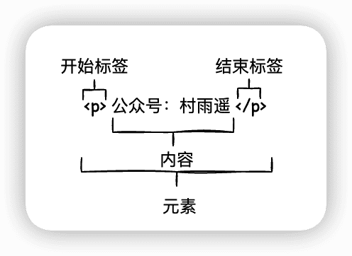

该元素中，主要组成部分如下：

- **开始标签**：由标签名称，大于号、小于号所组成，表示元素从此处开始生效。
- **结束标签**：类似于开始标签，只是在标签名之前多了一个斜杠 `/`，表示元素的结尾。
- **内容**：元素的内容。

以下就来看看，HTML 中的各种常用标签。

### `<!DOCTYPE html>`

放在 HTML 文件中的首行，主要用于标识文档类型。

### `<html>`

HTML 文档中的根标签，包含了整个页面的所有内容，其他所有标签都包含在 `html` 标签中。

### `<head>`

这个元素中的内容对用户是不可兼得，主要用于设置网页字符编码、CSS 样式、页面描述、搜索关键字等信息。

```html
<!DOCTYPE html>
<html>
	<head>
		<meta charset="utf-8" />
		<meta name="viewport" content="width=device-width, initial-scale=1">
		<title>HTML 标题</title>
	</head>
</html>
```

### `<body>`

网站主体内容，如果想让我们的内容显示在网页中让其他用户在访问该界面时看见，则内容需要写在该标签中，主要包括文本、图形、视频或其他内容。

以下是一个在网页中显示内容的实例。

```html
<!DOCTYPE html>
<html>
    <body>
		公众号：村雨遥
	</body>
</html>
```

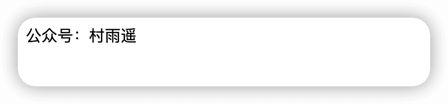

### `<title>`

网页标题，在 `head` 标签中设置后，打开网页时将显示为网页标题。

以下是一个实例。

```js
<!DOCTYPE html>
<html>
	<head>
		<title>HTML 标题</title>
	</head>
</html>
```


### `<p>`

文本标签，用于定义段落。该标签会自动在其前后创建一些空白，浏览器将自动添加这些空间。

```html
<!DOCTYPE html>
<html>
	<head>
		<meta charset="utf-8" />
		<meta name="viewport" content="width=device-width, initial-scale=1">
		<title>HTML 标题</title>
	</head>
	<body>
		<p>这是一段文本</p>
	</body>
</html>

```

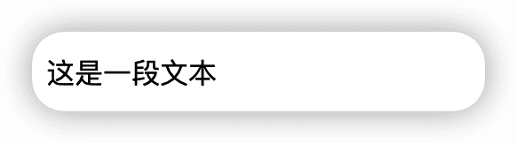

### 标题

此处的标题不同与上边的 `title` 标签，`title` 设置的主要是网页标题，二次数的标题主要是是针对 `body` 标签中的标题。

这里的标题又可以分为 6 级，其对应标签分别是：`<h1>`、`<h2>`、`<h3>`、`<h4>`、`<h5>`、`<h6>`。

```html
<!DOCTYPE html>
<html>
	<head>
		<meta charset="utf-8" />
		<meta name="viewport" content="width=device-width, initial-scale=1">
		<title>HTML 标题</title>
	</head>
	<body>
		<h1>一级标题</h1>
		<h2>二级标题</h2>
		<h3>三级标题</h3>
		<h4>四级标题</h4>
		<h5>五级标题</h5>
		<h6>六级标题</h6>
	</body>
</html>
```

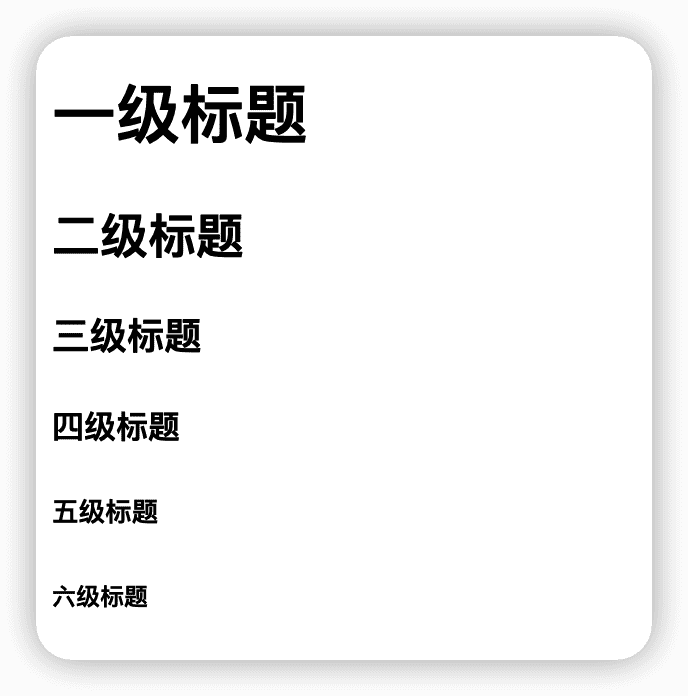

### `</br>`

表示换行，不同于 `title` 等标签，它是一个单标签，即开始标签和结束标签都是同一个，单词放在标签名之前。

```js
<!DOCTYPE html>
<html>
    <body>
		公众号</br>
		村雨遥
	</body>
</html>
```

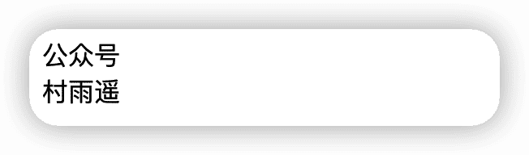

### ``

表示图片标签，通过该属性我们可以在网页中添加一张图片。

此外，`img` 标签提供 `src` 属性用于设置图片路径，`height` 属性设置图片高度，`width` 属性设置图宽度。为了防止图片失效造成误解，我们还可以给图片添加一个提示，此时使用 `alt` 属性即可。

```html
<!DOCTYPE html>
<html>
	<head>
		<meta charset="utf-8" />
		<meta name="viewport" content="width=device-width, initial-scale=1">
		<title>HTML 标题</title>
	</head>
	<body>
		
	</body>
</html>
```


```html
<!DOCTYPE html>
<html>
	<head>
		<meta charset="utf-8" />
		<meta name="viewport" content="width=device-width, initial-scale=1">
		<title>HTML 标题</title>
	</head>
	<body>
		
	</body>
</html>
```

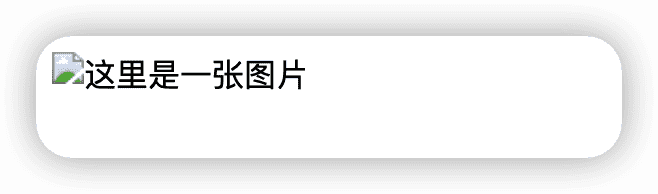

### `<a>`

在某一个网页中，我们要通过超链接来跳转到另一个页面，则此时需要用到 `<a>` 标签，当然该标签中最重要的 `href` 属性也不能少，它用于指示跳转的目标网页。

```html
<!DOCTYPE html>
<html>
	<head>
		<meta charset="utf-8" />
		<meta name="viewport" content="width=device-width, initial-scale=1">
	</head>
	<body>
		<a href="https://cunyu1943.github.io/JavaPark">JavaPark(Java 自学指南)</a>
	</body>
</html>
```


### 列表

列表可以分为有序列表和无序列表，其中有序列表是由 `ol` 标签标识。

```html
<!DOCTYPE html>
<html>
	<head>
		<meta charset="utf-8" />
		<meta name="viewport" content="width=device-width, initial-scale=1">
		<title>HTML 标题</title>
	</head>
	<body>
		<ol>
			<li>《网球王子》</li>
			<li>《灌篮高手》</li>
			<li>《鬼灭之刃》</li>
		</ol>
	</body>
</html>
```

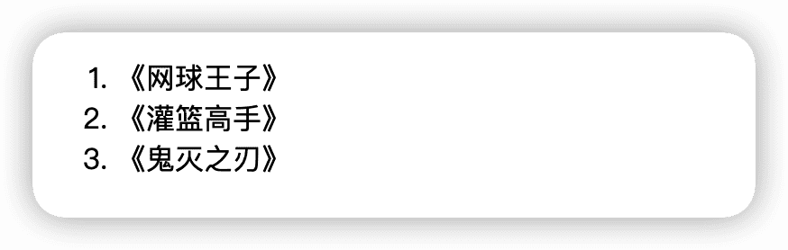

有序列表中，可以在 `ol` 标签中添加 `start` 属性，用于表示从第几位开始，`type` 属性用于标识所要显示的类型。

| type | 说明                       |
| ---- | -------------------------- |
| `1`  | 显示类型为数字类型         |
| `A`  | 显示类型为大写字母类型     |
| `a`  | 显示类型为小写字母类型     |
| `I`  | 显示类型为大写罗马数字类型 |
| `i`  | 显示类型为小写罗马数字类型 |

```html
<!DOCTYPE html>
<html>
	<head>
		<meta charset="utf-8" />
		<meta name="viewport" content="width=device-width, initial-scale=1">
		<title>HTML 标题</title>
	</head>
	<body>
		<ol type="I" start="2">
			<li>《网球王子》</li>
			<li>《灌篮高手》</li>
			<li>《鬼灭之刃》</li>
		</ol>
	</body>
</html>
```

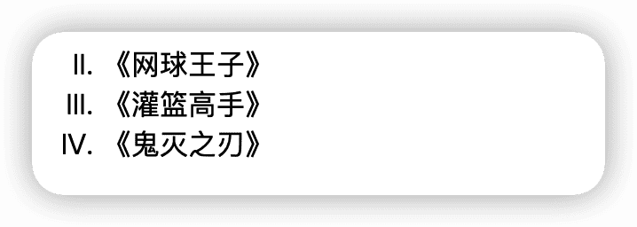

除开有序列表之外，还有无序列表，无序列表以 `ul` 标识。

```html
<!DOCTYPE html>
<html>
	<head>
		<meta charset="utf-8" />
		<meta name="viewport" content="width=device-width, initial-scale=1">
		<title>HTML 标题</title>
	</head>
	<body>
		<ul>
			<li>嵩山派</li>
			<li>泰山派</li>
			<li>恒山派</li>
		</ul>
	</body>
</html>
```

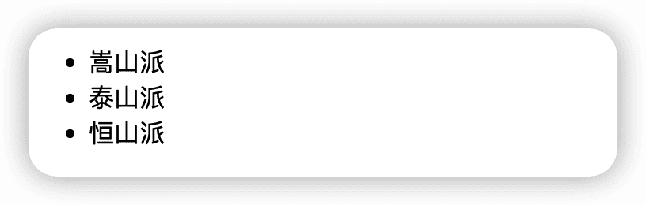

无序列表虽然没有顺序之分，但是同样提供了 `type` 属性。

| type     | 说明                   |
| -------- | ---------------------- |
| `disc`   | 小圆黑点，默认显示方式 |
| `circle` | 空心圆圈               |
| `square` | 小黑方形               |

```js
<!DOCTYPE html>
<html>
	<head>
		<meta charset="utf-8" />
		<meta name="viewport" content="width=device-width, initial-scale=1">
		<title>HTML 标题</title>
	</head>
	<body>
		<ul type="circle">
			<li>嵩山派</li>
			<li>泰山派</li>
			<li>恒山派</li>
		</ul>
		<ul type="square">
			<li>西施</li>
			<li>王昭君</li>
			<li>杨玉环</li>
		</ul>
	</body>
</html>
```

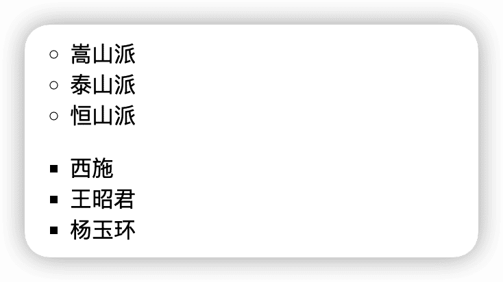

### `<b>`

要实现对内容加粗，可以使用 `<b>` 标签。

```html
<!DOCTYPE html>
<html>
	<head>
		<meta charset="utf-8" />
		<meta name="viewport" content="width=device-width, initial-scale=1">
	</head>
	<body>
		<b>重点</b>提醒
	</body>
</html>
```


### `<u>`

有时需要对内容做下划线处理，则可以使用 `<u>` 标签。

```html
<!DOCTYPE html>
<html>
	<head>
		<meta charset="utf-8" />
		<meta name="viewport" content="width=device-width, initial-scale=1">
	</head>
	<body>
		<u>下划线</u> 展示
	</body>
</html>
```

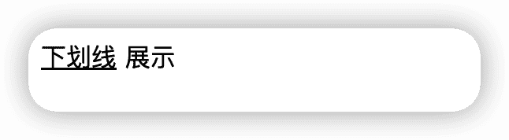

### `<i>`

为了将文本以斜体的方式显示给浏览器，可以使用 `<i>` 标签。

```html
<!DOCTYPE html>
<html>
	<head>
		<meta charset="utf-8" />
		<meta name="viewport" content="width=device-width, initial-scale=1">
	</head>
	<body>
		<i>世界上只有一种真正的英雄主义，就是认清了生活的真相后还依然热爱它 -- 罗曼.罗兰</i>
	</body>
</html>
```


### 上下标

有时候我们需要在网页中显示数学或者化学公式，那么此时需要用到上下标，其中上标用标签 `<sup>` 表示，下标用标签 `<sub>` 表示。

```html
<!DOCTYPE html>
<html>
	<head>
		<meta charset="utf-8" />
		<meta name="viewport" content="width=device-width, initial-scale=1">
	</head>
	<body>
		x<sub>1</sub><sup>2</sup> + x<sub>2</sub><sup>2</sup> = 100;
	</body>
</html>
```

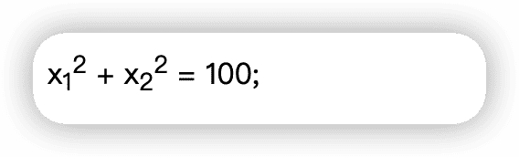

### `<table>`

表格标签 `<table>` 中又含有多个子标签，常用的子标签有如下。

- `th`：表头列
- `tr`：行
- `td`：列

同样的，表格标签还提供了以下这些常用的属性，用于给表格增加样式。但现在大多都是用 CSS 来对表格进行修饰，所以这些属性简单了解即可，不用太过深入。

| 属性          | 说明           |
| ------------- | -------------- |
| `border`      | 表格边框的粗细 |
| `width`       | 表格的宽度     |
| `cellspacing` | 单元格间距     |
| `cellpadding` | 单元格填充     |

```html
<!DOCTYPE html>
<html>
	<head>
		<meta charset="utf-8" />
		<meta name="viewport" content="width=device-width, initial-scale=1">
	</head>
	<body>
		<table border="1" width="500">
			<tr>
				<th>名字</th>
				<th>性别</th>
				<th>职业</th>
			</tr>
			<tr>
				<td>亚瑟</td>
				<td>男</td>
				<td>战士</td>
			</tr>
			<tr>
				<td>伽罗</td>
				<td>女</td>
				<td>射手</td>
			</tr>
			<tr>
				<td>米莱迪</td>
				<td>女</td>
				<td>法师</td>
			</tr>
		</table>
	</body>
</html>
```

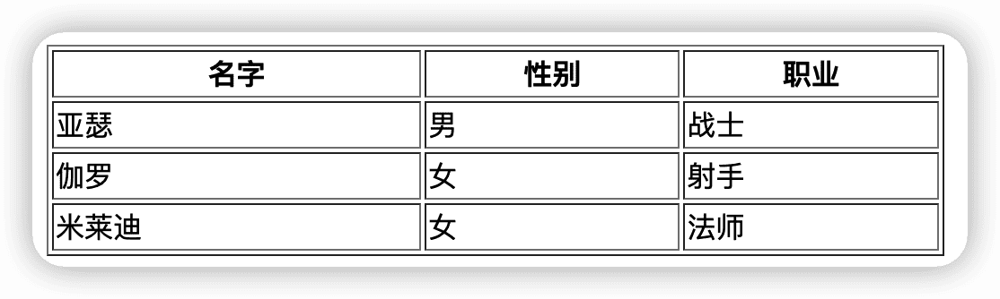

### `<form>`

`<form>` 表示文档中的一个区域，主要包含交互空间，用来向服务器提交信息。`<form>` 标签通常包含一个或者多个表单标签，常用的表单标签如下：

| 表单标签     | 说明   |
| ------------ | ------ |
| `<input>`    | 输入框 |
| `<textarea>` | 文本域 |
| `<button>`   | 按钮   |
| `<select>`   | 单选框 |

```html
<!DOCTYPE html>
<html>
	<head>
		<meta charset="utf-8" />
		<meta name="viewport" content="width=device-width, initial-scale=1">
	</head>
	<body>
		<form action="" method="post">

			<label for="name">姓名: </label>
			<input type="text" name="name" id="name"></br>
			<label for="email">邮箱: </label>
			<input type="email" name="email" id="email"></br>

			<input type="submit" value="提交">

		</form>
	</body>
</html>
```

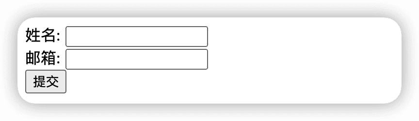

其中 `action` 属性用来处理表单提交的 URL，`method` 属性表示使用何种 HTTP 方式来提交表单，常用的值有 `post` 和 `get`。

## 总结

本文介绍了 HTML 的定义，然后对 HTML 中常用的标签进行了举例学习。
