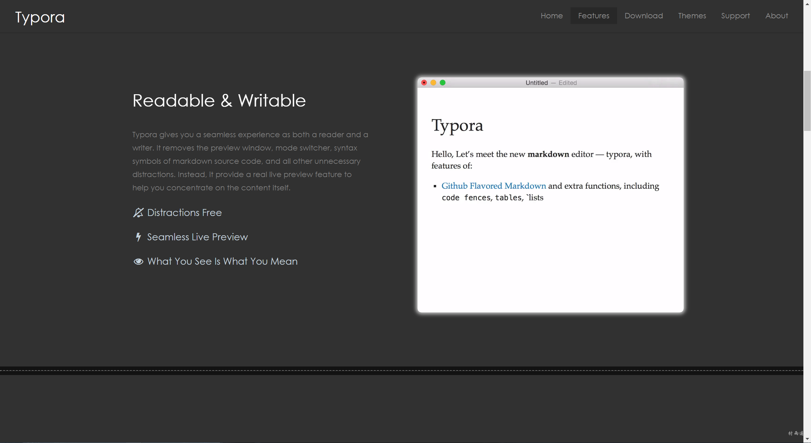
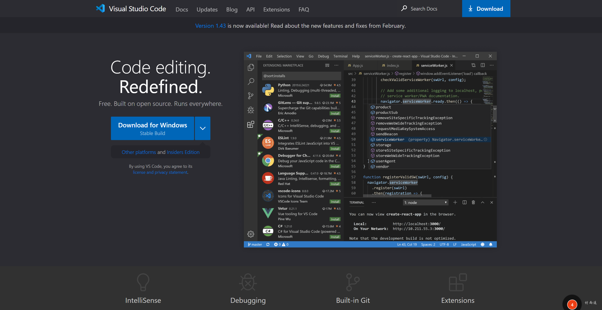

作者：村雨遥

博客：[JavaPark](https://cunyu1943.github.io/JavaPark)

> 吾生也有涯，而知也无涯。

---

## 什么是 Markdown 格式

Markdown 格式是一种可用普通文本编辑器编写的标记语言，使用者能够通过简单的标记语法，对自己所写文本内容进行简单的格式排版。如果你经常逛 Github，你会发现大多数项目下边都会有一个 `README.md` 的项目说明文件，而它就是利用 Markdown 来进行编写的。而现在的大多数博客平台如 CSDN、博客园、掘金等，基本都支持 Markdown 格式，如果你有多平台发布文章的需求，那么学会用 Markdown 来编写内容未尝不是一个好的方法。

而且就算微信公众号，我们也可以借助第三方工具来进行排版，比起之前用 Word 来排版的方式省去了很多麻烦，实现一文多发变得更加容易，不用再去调格式适应不同平台。

## 优点

- 语法简洁易学，且功能比纯文本强大；

- 格式转换方便，兼容性强，可读性极好；
- 专注内容写作而不用关注排版样式；
- 能导出 PDF、HTML 等格式的文件；
- 迁移、反复编辑不会导致格式错乱；

## 写作格式

### 标题

一到六级标题如下，每多一级则多加一个`#`号，**注意**：符号和标题内容间的空格不能省略，具体格式如下：

```markdown
# 一级标题

## 二级标题

### 三级标题

#### 四级标题

##### 五级标题

###### 六级标题
```


### 列表

列表又分为有序列表和无序列表；

- 有序列表：`阿拉伯数字 + . + 空格 + 内容`，具体格式如下：

```markdown
1. 蒂姆.邓肯
2. 马努.比诺比利
3. 托尼.帕克
```


- 无序列表：`英文横杠 + 空格 + 内容`，具体格式如下：

```markdown
- Apple
- Orange
- Banana
```


### 加粗

内容前后分别用两个 `*` 将其括起来，即 `** + 内容 + **`，具体格式如下：

```markdown
**公众号：村雨遥**
```


### 斜体

和加粗很类似，不过只需要将内容前后分别用一个 `*` 包围起来即可，即 `* + 内容 + *`，具体格式如下：

```markdown
_公众号：村雨遥_
```


### 删除线

要给内容加上删除线的效果，只需要在内容前后分别用两个 `~` 将其包围即可，即 `~~ + 内容 + ~~`，具体格式如下：

```markdown
~~ 公众号：村雨遥 ~~
```


### 下划线

要实现下划线的效果，可以借助 HTML 语法 `<u> + 内容 + </u>`，具体格式如下：

```markdown
<u>公众号：村雨遥</u>
```


### 分割线

如果要将不同内容之间插入一条分割线，可以使用 `---` 单独占一行来实现，具体格式如下：

```markdown
公众号：村雨遥

---

个人博客：https://cunyu1943.github.io

---

知乎：https://www.zhihu.com/people/cunyu1943

---
```


### 引用

要引用其他人的话时，可以使用 `> + 内容` 的形式，具体格式如下：

```markdown
> 吾生也有涯，而知也无涯。
```


### 上下标

当我们需要写化学公式或者需要标记上下标时，该怎么办呢？

- 上标：`^内容^`
- 下标：`~内容~`

```markdown
1. 上标

   H^2^O

2. 下标

   H~2~O
```


### 高亮

高亮语法在有的 Markdown 标准中可能不支持，但在这里也给出其用法，即 `== + 内容 + ==`，具体格式如下：

```markdown
==公众号：村雨遥==
```


### 任务列表

任务列表是我们经常接触到的东西，比如我们的备忘录，完成的事件和未完成事件，要在 Markdown 中实现同样效果，可以使用如下的格式：

- 已完成：`[x] + 内容`
- 未完成：`[] + 内容`

```markdown
1. 未完成任务

   - [ ] 公众号：村雨遥
   - [ ] 个人博客：https://cunyu1943.github.io

2. 已完成任务
   - [x] 知乎：https://www.zhihu.com/people/cunyu1943
   - [x] CSDN：https://blog.csdn.net/github_39655029
```


### 目录生成

当我们文章写完之后，想要像 Word 中那样自动生成目录，此时就可以使用 `[TOC]` 单独占一行来实现，但是要注意，有的平台可能不支持该用法，具体格式如下：

```markdown
@[toc]
```


### 表格

Markdown 中的表格也很方便，我们可以用 `:` 来调整表格对齐的方式，具体格式如下：

```markdown
1. 左对齐
   | 平台 | 链接 |
   | :------- | :------------------------------------- |
   | 公众号 | 村雨遥 |
   | 个人博客 | https://cunyu1943.github.io |
   | 知乎 | https://www.zhihu.com/people/cunyu1943 |

2. 居中对齐

|   平台   |                  链接                  |
| :------: | :------------------------------------: |
|  公众号  |                 村雨遥                 |
| 个人博客 |      https://cunyu1943.github.io       |
|   知乎   | https://www.zhihu.com/people/cunyu1943 |

3. 右对齐
   | 平台 | 链接 |
   | -------: | -------------------------------------: |
   | 公众号 | 村雨遥 |
   | 个人博客 | https://cunyu1943.github.io |
   | 知乎 | https://www.zhihu.com/people/cunyu1943 |
```


### 公式

Markdown 支持 LaTeX 语法，可以实现行间公式和独立公式块，公式的写法和 LaTeX 语法一样，具体格式如下

- 行间公式：`$ + 公式 + $`
- 独立公式块：`$$ + 公式 + $$`

```markdown
1. 行间公式

   $x_1+x_2=0$

2. 独立公式块

   $$x^2+y^2=0$$
```


### 代码块

同公式一样，代码块同样可以分为行间代码块和独立代码块，其区别在于用一个或多个 \` 将其括起来，具体格式如下：


### 链接与图片

链接和图片的唯一区别在于图片需要在最前面加上一个 `!`，两个具体格式如下：

- 链接：`[链接说明](url)`
- 图片：``

```markdown
1. 链接

[村雨遥的杂货铺](https://cunyu1943.site)

2. 图片


```


## 编辑器推荐

好了，学习了上面的之后，是不是想马上动手试试。既然如此，那就再给大家推荐几款编辑器，让你的效率更上一层楼，PS：**多学习快捷键使用，效果更佳哦！**

1. [Typora](https://www.typora.io/)：跨平台多功能 Markdown 编辑器，支持导出 PDF、HTML 等格式。



2.  [MarkText](https://marktext.app/)：跨平台开源 Markdown 编辑器，支持斗图哦！


3.  [Visual Studio Code](https://code.visualstudio.com/)：巨硬出品，必属精品，哈哈，需要配合插件使用！



## 注意事项

1. `Markdown`兼容`HTML`相关语法；
2. 对于特殊字符，可以通过转义字符`\`将其显示出来；