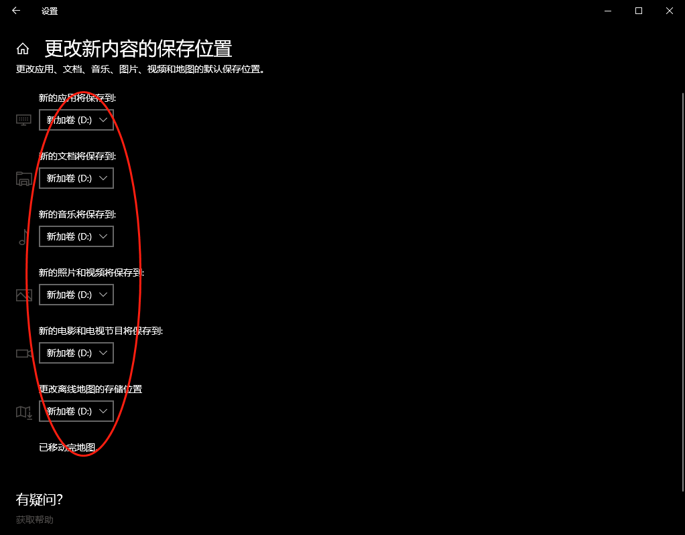
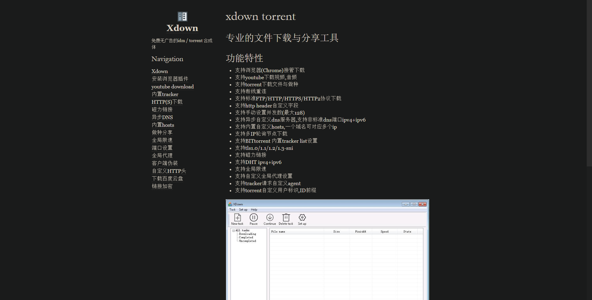

作者：村雨遥

博客：[JavaPark](https://cunyu1943.github.io/JavaPark)

> 吾生也有涯，而知也无涯。

## 前言

都 2021 年了，Windows 10 都已经发布 6 年多了，我个人也是从 Windows 10 一发布就从 Windows 7 换到了 Windows 10。就个人体验而言，我觉得 Windows 10 比 Windows 7 好用多了，许多方面都进行了改进。当然了，这只是个人感受，如果您有不同的想法，也不用急着和我争辩，毕竟萝卜白菜，各有所爱嘛，那接下来就说说如何优雅的使用 Windows 10。这些只是个人的使用经验，总结成本文章，供大家参考参考。

本文基于 Windows 10 专业版（20H2）进行配置及截图，理论上讲适用于 Windows 10 所有版本，略有出入的地方还请多多包涵，可以尝试搜索网上的解决方案。

本文主要从以下几个方面进行讲解；

1.  系统设置
2.  软件推荐

3.  日常使用小技巧

## 系统设置

### 资源管理器设置

- 在**查看**选项中，将**文件扩展名**勾选，并打开**选项**设置；

- 在常规选项下，将“**打开文件资源管理器时打开**”后的下拉框设置为此电脑，然后在“**隐私**”将关于快速访问相关选项去掉勾选，最后点击“**确认**”；

### 修改默认存储位置

打开设置，选中**系统**设置下的**存储**子栏目，然后**更改新内容保存的位置**，将**默认的 C 盘**改为**你想要存储的盘**，我的设置中**以 D 盘为例**，具体看个人喜好，设置步骤如下；

### 修改常用文件夹的默认路径

对于大多人而言，桌面内容一般都是保存在 C 盘下面。这符合大部分人的使用习惯，但是对于我就不同了，我可是个小机灵鬼，被系统搞崩重装系统搞怕了，所以我一般会把桌面等内容保存在其他非系统盘位置。那想要修改如下**桌面**、**文档**、**下载**等的默认路径（默认为 C 盘），应该如何操作呢，以下以**桌面**为例，其他文件夹的操作都一样！

1.  选中桌面，鼠标右键，选择属性；

1.  选中**位置**，然后修改下边方框中**你的自定义路径**；

1.  修改成你的自定义路径后，点击**确定**即可；

## 软件安装篇

首先说明，不是给下边软件打广告呀，只是我自己体验下来，觉得适合自己的，当然你也可以有自己的选择，全凭个人喜好嘛，哈哈。

### 输入法

- [**手心输入法**](http://www.xinshuru.com/index.html?p=win)：360 旗下产品，无广告，告别骚扰。

- [**QQ 输入法**](http://qq.pinyin.cn/)：鹅厂出品，斗图十分方便呀！

### 压缩软件

- [**Bandizip**](http://www.bandisoft.com/)：一家韩国公司出品的解压缩软件，速度与颜值并存，之前的版本都没有广告，现在的新版本中加入了广告，不过也不影响使用。

- [**7-zip**](https://www.7-zip.org/)：功能强大，不过颜值略低，颜值党就不推荐了，😄；

- [**360 压缩**](https://yasuo.360.cn/)：360 又来了，不过完全放心，这不像 xxx 安全中心那么额，咋说呢，就很良心！

### 通讯浏览

- [**微信**](https://weixin.qq.com/) ：这就不用说了，大家都或多或少要用到。

- [**Tim**](https://tim.qq.com/) ：QQ 办公版，告别花里胡哨的东西，专注于办公。

- [**Chrome**](https://www.google.cn/intl/zh-CN/chrome/)：谷歌旗下浏览器，也是目前世界上份额最大的。你可能说用不了 Google，但通过一番设置调教之后，它仍会是最强大的浏览器。

- [新版 Edge](https://www.microsoft.com/en-us/edge)：最终巨硬还是屈服了，换用 Chromium 内核的 Edge 能否与 Chrome 一战呢？我觉得有戏！

### 文字编辑

- [**Typora**](https://www.typora.io/)：跨平台 Markdown 编辑器，个人觉得比许多收费的都好用。

- [**Mark Text**](https://marktext.app/)：开源跨平台 Markdown 编辑器，最大的特色就是支持斗图！！！

- [**PicGo**](https://molunerfinn.com/PicGo/)：搭配前两者使用的图片上传工具，通过搭建自己的图床，实现对图片的管理。

### 代码编辑器

- [**VS Code**](https://code.visualstudio.com/)：巨硬出品，实现弯道超车，成为目前大多程序员的第一选择。

- [**Atom**](https://atom.io/)：Github 出品，不过现在 Github 已经被巨硬收购，所以也能叫巨硬出品了，哈哈。

- [**Sublime Text**](https://www.sublimetext.com/)：颜值较高的一款编辑器。

### 软件卸载

- [**IObit**](https://www.iobit.com/en/index.php?s)：个人比较推荐的一款软件卸载工具，自动去除依赖，还能实时监控软件。

### 下载工具

- [**Motrix**](https://motrix.app/zh-CN/)：开源下载工具，颜值与实用共存，去你的某雷。

- [**IDM**](https://www.internetdownloadmanager.com/)：多线程下载工具，搭配 Chrome，简直不要太爽！

- [**Xdown**](https://xdown.org/)：相当于 IDM 的一个免费版本吧，搭配插件，可以下载百度云分享资源哦！

## 日常使用小技巧

### 常用系统操作快捷键

| 快捷键                 | 说明                            |
| ---------------------- | ------------------------------- |
| **Alt + Tab**          | 应用切换                        |
| **Win + Tab**          | 桌面切换                        |
| **CapsLock**           | 切换大小写                      |
| **Ctrl + Shift**       | 输入法切换                      |
| **Ctrl + Shift + Esc** | 任务管理器                      |
| **Win + Space**        | 输入法切换                      |
| **Win + 数字键**       | 切换任务栏中的对应应用          |
| **Win + 上/下/左/右**  | 当前窗口最大化/最小化/居左/居右 |
| **Win + R**            | 打开运行                        |
| **Win + E**            | 打开资源管理器                  |
| **Win + D**            | 显示桌面                        |
| **Win + M**            | 最小化所有窗口                  |
| **Win + G**            | 游戏录制                        |
| **Win + A**            | 打开通知                        |
| **Win + I**            | 打开 Windows 设置               |
| **Win + X**            | 显示系统选项                    |
| **Win + V**            | Windows 10 自带剪切板           |
| **Win + P**            | 投影设置                        |
| **Win + L**            | 锁屏                            |
| **Win + Q/S**          | 快速打开 Cortans 搜索框         |
| **Win + W**            | 白板                            |
| **Win + .**            | 打开 Emoji 面板                 |

### 文件文档处理快捷键

对我们而言，用电脑平时接触最多的就是文件文档处理工作，牢记如下这些快捷方式，能大大提高你的工作效率，早点下班回家不香么？

| 快捷键               | 说明                 |
| -------------------- | -------------------- |
| **Ctrl + C**         | 复制                 |
| **Ctrl + X**         | 剪切                 |
| **Ctrl + V**         | 粘贴                 |
| **Ctrl + A**         | 全选                 |
| **Ctrl + F**         | 查找                 |
| **Ctrl + Z**         | 撤销操作             |
| **Ctrl + Y**         | 还原操作             |
| **Ctrl + N**         | 新建文件             |
| **Ctrl + O**         | 打开“打开文件”对话框 |
| **Ctrl + B**         | 加粗                 |
| **Ctrl + I**         | 斜体                 |
| **Ctrl + U**         | 下划线               |
| **Ctrl + E**         | 当前行居中           |
| **Ctrl + P**         | 打印                 |
| **Ctrl + Shift + N** | 新建文件夹           |

### 截图

想必大家都习惯了登上 QQ 或者微信来截图，但如果我们没网的时候咋整？你可能会说，我提前下个截图软件不就好了！嗯哼，这不失为一种解决方案，但 Windows 自带的截图工具已经十分强大，大家完全可以不用借助其他工具辅助；

| 快捷键                | 说明                                         |
| --------------------- | -------------------------------------------- |
| **Win + Shift + S**   | 框选截屏，复制到粘贴板                       |
| **PrintScreen**       | 默认全屏截图，复制到粘贴板，**不会提醒**     |
| **Win + PrintScreen** | 当前全屏截图保存到 “库 - 图片 - 屏幕截图”    |
| **Alt + PrintScreen** | 默认将当前窗口截屏复制到粘贴板，**不会提醒** |

## 总结

以上就是 Windows 使用过程中的一些小技巧了，如果你有更多好玩又好用的技巧而我又没有提到的，欢迎留言交流呀！
